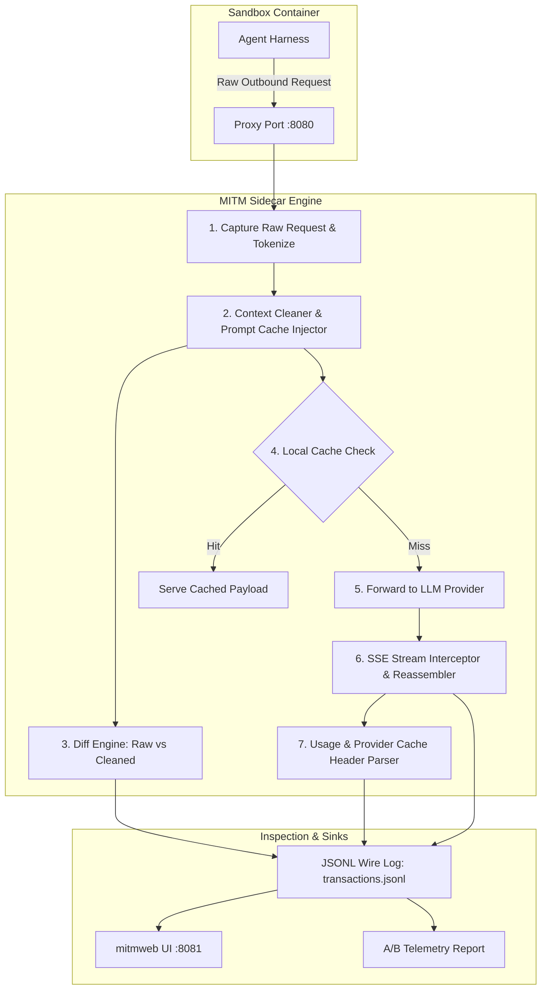
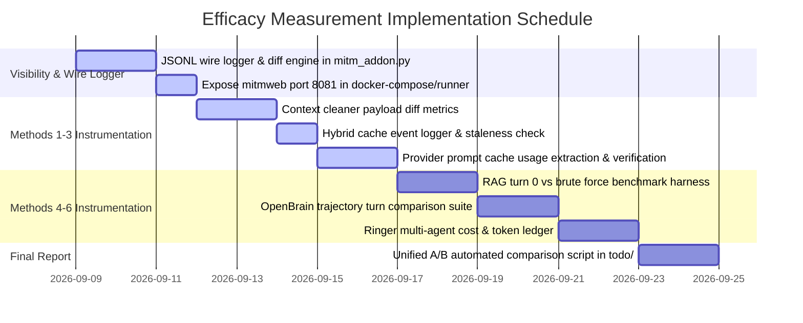

# Token Reduction & Optimization Efficacy Measurement Plan

This document outlines the architecture, instrumentation strategy, and step-by-step methodology for inspecting
wire-level LLM traffic and measuring the empirical effectiveness of all six token reduction techniques across the
`holon-agentic-coder-ref` ecosystem.

---

## 🎯 Problem Statement & Diagnostic

### Why Payloads Are Currently Opaque in MITM

During live runs, token counters increment, but developers cannot see the actual requests sent or responses received.
This occurs because:

1. **Summarized Console Logging**:
   [`mitm_addon.py`](../../holon-agentic-coder-ref/develop/apps/sandbox-executor/src/sandbox_executor/token_reduction/mitm_addon.py)
   outputs only single-line `📊 [TELEMETRY]` summaries to standard output.
2. **Streaming (SSE) Buffering Without Inspection Sinks**: When agents stream responses via Server-Sent Events (SSE),
   chunks are assembled in-memory solely to parse usage metadata and count tokens, without emitting the full
   reconstructed text or prompt diffs to disk or console.
3. **Headless Proxy Execution**: In standard Docker sidecar runs, `mitmdump` runs headlessly without a persistent
   transaction log or web UI attached.

### Objectives of This Measurement Plan

1. **100% Wire-Level Visibility**: Capture and log the complete uncleaned request, transformed (cleaned) request, and
   reconstructed upstream response for every turn.
2. **Empirical Measurement Across All 6 Techniques**:
   - **Context Cleaning & Deduplication**
   - **Local Hybrid & Semantic Caching**
   - **Provider Prompt Cache Optimisation**
   - **RAG Codebase Indexer**
   - **OpenBrain Memory Layer**
   - **Ringer Multi-Agent Framework**
3. **Reproducible A/B Verification**: Quantify exact token deltas, financial cost reductions, latency changes, and task
   success rates between baseline and optimized runs.

---

## 🔬 System Architecture for Full Traffic Inspection



---

## 📡 Part 1: Real-Time Request & Response Wire Inspection

To inspect the raw traffic going out and coming back in real time:

### 1. Structured Wire Logger (`todo/mitm_wire_logs/`)

Add a structured file logger to
[`mitm_addon.py`](../../holon-agentic-coder-ref/develop/apps/sandbox-executor/src/sandbox_executor/token_reduction/mitm_addon.py)
that appends full transaction details to `${WIRE_LOG_DIR}/turn_{turn_id}_{flow_id}.json` and
`${WIRE_LOG_DIR}/transactions.jsonl`.

- **Log Directory Parameterization**: Configure the destination directory via the `WIRE_LOG_DIR` environment variable:
  ```python
  WIRE_LOG_DIR = os.getenv("WIRE_LOG_DIR", "todo/mitm_wire_logs")
  ```
  In local development, transactions default to `todo/mitm_wire_logs/`. When running inside Docker containers, pass
  `-e WIRE_LOG_DIR=/tmp/wire_logs` so output writes directly to the mounted `/tmp/wire_logs` host volume.
- **Concurrent Multi-Agent Flow Scoping & Non-Blocking I/O**: When running multi-agent workflows (such as Method 6
  Ringer), multiple subagents execute concurrently through `:8080`. Individual transaction dump files are scoped by turn
  ID and flow or subagent ID (`turn_{turn_id}_{flow_id}.json`) to prevent write collisions and file overwrites.
  Furthermore, disk writes for `transactions.jsonl` must use atomic line appending or an asynchronous logging queue to
  prevent blocking the mitmproxy event loop and distorting TTFT and latency metrics.
- **Credential & Secret Sanitization**: In accordance with security best practices, `dump_wire_transaction()` must scrub
  all sensitive credential headers (`Authorization`, `x-api-key`, `api-key`, `x-goog-api-key`, `holon-agent-key`,
  `proxy-authorization`) by replacing their values with `"[REDACTED]"`. In addition, `dump_wire_transaction()` must
  scrub URL query parameters matching sensitive keys (e.g., stripping Google Gemini `?key=...` or `?api_key=...`
  parameter values to `?key=[REDACTED]`) prior to persisting transaction payloads or endpoint URLs to disk.

```json
{
  "turn_id": 4,
  "flow_id": "flow_a1b2c3d4",
  "timestamp": "2026-09-08T21:30:00.000Z",
  "provider": "anthropic",
  "endpoint": "https://api.anthropic.com/v1/messages",
  "headers": {
    "content-type": "application/json",
    "x-api-key": "[REDACTED]",
    "authorization": "[REDACTED]"
  },
  "raw_request": {
    "model": "claude-3-5-sonnet-20241022",
    "messages": [...]
  },
  "cleaned_request": {
    "model": "claude-3-5-sonnet-20241022",
    "messages": [...]
  },
  "delta": {
    "raw_chars": 28450,
    "cleaned_chars": 12100,
    "chars_saved": 16350,
    "tool_outputs_omitted": 2,
    "cache_control_injected": 3
  },
  "cache_action": "MISS",
  "response": {
    "status": 200,
    "usage": {
      "input_tokens": 3120,
      "cache_creation_input_tokens": 0,
      "cache_read_input_tokens": 2850,
      "output_tokens": 420
    },
    "content": "..."
  },
  "timing": {
    "ttft_ms": 320.5,
    "total_ms": 2450.0
  }
}
```

### 2. Live Web Dashboard (`mitmweb`)

Instead of running headless `mitmdump`, expose `mitmweb` with the web interface on port `8081`:

```bash
# Ensure log directory exists on host prior to container startup
mkdir -p todo/mitm_wire_logs

docker run --rm -it \
  -p 127.0.0.1:8080:8080 \
  -p 127.0.0.1:8081:8081 \
  -e WIRE_LOG_DIR=/tmp/wire_logs \
  -e PYTHONPATH=/tmp/src \
  -v $(pwd)/holon-agentic-coder-ref/develop/apps/sandbox-executor/src:/tmp/src:ro \
  -v $(pwd)/holon-agentic-coder-ref/develop/apps/sandbox-executor/src/sandbox_executor/token_reduction/mitm_addon.py:/tmp/mitm_addon.py:ro \
  -v $(pwd)/todo/mitm_wire_logs:/tmp/wire_logs \
  -v ~/.holon/proxy-ca:/home/mitmproxy/.mitmproxy \
  mitmproxy/mitmproxy:12.2.3 \
  mitmweb -s /tmp/mitm_addon.py --web-host 0.0.0.0 --web-port 8081 --listen-port 8080
```

- Navigate to `http://localhost:8081` in your browser.
- Every HTTP request, modified body, diff view, SSE event stream, and header will be interactively visualizable and
  inspectable in real time.

> [!NOTE] **Security Advisory**: Ports `8080` and `8081` are bound to loopback `127.0.0.1` by default. If binding to an
> external network interface (e.g., in shared staging or remote environments), pass `--web-password <PASSWORD>` to
> `mitmweb` to prevent unauthorized inspection of captured payloads and credentials.

---

## 📊 Part 2: Measuring the 6 Token Reduction Methods

| Method                      | Primary Target                          | Measurement Metric                                          | Instrumentation Point                                |
| :-------------------------- | :-------------------------------------- | :---------------------------------------------------------- | :--------------------------------------------------- |
| **1. Context Cleaning**     | Redundant tool outputs ($O(N^2)$ bloat) | Chars/tokens pruned; omitted blocks count; context slope    | Pre- vs Post-cleaning request payload comparison     |
| **2. Local Cache**          | Repeated identical/equivalent queries   | Cache hit rate; short-circuited API calls; zero-token turns | SQLite cache queries & short-circuit response branch |
| **3. Prompt Cache Optim.**  | Upstream input prompt re-processing     | Provider `cache_read_tokens` vs total input tokens; $ saved | Provider usage metadata & response headers           |
| **4. RAG Codebase Indexer** | Repository context explosion at turn 0  | Turn 0 prompt token count; search tool calls; precision     | Initial plan prompt size & tool invocation counters  |
| **5. OpenBrain Memory**     | Redundant exploration & trial-and-error | Session turns to completion; injected memory tokens         | Memory injection size & trajectory turn count        |
| **6. Ringer Framework**     | Expensive model token burn on execution | Architect tokens vs Subagent tokens; total $ cost           | Multi-agent token accounting by model tier           |

---

### Method 1: Context Cleaning & Deduplication

#### What to Measure:

1. **Raw vs Cleaned Payload Size**: Difference in character count and estimated token count before and after cleaning.
2. **Deduplication Rate**: Number of repeated `tool_result` items replaced by reference markers
   (`[Omitted: Tool result content is identical to Turn X]`).
3. **Context Growth Trajectory**: Plot of token count per turn across a 30-turn agent session comparing uncleaned
   baseline vs cleaned run.
4. **Accuracy Preservation**: Verification that the agent did not fail or repeat commands due to missing omitted
   content.

#### Measurement Formula:

$$\text{Cleaning Reduction Ratio} = \frac{\text{Tokens}_{\text{raw}} - \text{Tokens}_{\text{cleaned}}}{\text{Tokens}_{\text{raw}}} \times 100\%$$

#### Instrumentation:

- In `mitm_addon.py:request()`, calculate hash and length of `data` (incoming) vs `cleaned_data` (outgoing).
- Emit a `CLEANER_METRICS` event with:
  - `omitted_tool_blocks_count`
  - `summarized_turns_count`
  - `net_bytes_saved`

---

### Method 2: Local & Semantic Cache

> [!NOTE] **Streaming Request Bypass & Cache Evaluation Constraint**: In the current implementation of `mitm_addon.py`,
> streaming requests (`stream: true` or SSE endpoints) bypass local cache storage and retrieval (`put()` and `get()`)
> because returning cached completions requires token-by-token stream replay. Therefore, when evaluating Method 2
> (_Local Hybrid & Semantic Caching_) in benchmarks, agent harnesses must be configured in non-streaming mode to observe
> cache hits and short-circuited token savings. Synthetic SSE stream replay for cached responses is planned for a future
> iteration.

#### What to Measure:

1. **Exact Cache Hit Rate**: Percentage of requests served directly from SQLite without outbound network calls.
2. **Semantic Similarity Hit Rate**: Count of queries matched via Jaccard/embedding similarity above threshold
   ($> 0.85$).
3. **Short-Circuited Token Savings**: Cumulative API prompt and completion tokens avoided ($100\%$ discount on hits).
4. **Staleness / Error Rate**: Frequency of cache invalidations or faulty tool actions caused by replaying previous
   responses.

#### Measurement Formula:

$$\text{Local Cache Hit Rate} = \frac{\text{Requests}_{\text{cached}}}{\text{Requests}_{\text{total}}} \times 100\%$$
$$\text{Tokens Avoided} = \sum_{\text{cache hits}} (\text{Prompt Tokens} + \text{Completion Tokens})$$

#### Instrumentation:

- In `hybrid_cache.py:get()`, log cache query results with `key`, `hit_type` (`EXACT`, `SEMANTIC`, `MISS`),
  `similarity_score`, and `hit_count`.

---

### Method 3: Provider Prompt Cache Optimisation

#### What to Measure:

1. **Provider Cache Read Tokens**: Number of prompt tokens billed at the cached rate (e.g., Anthropic
   `cache_read_input_tokens`, OpenAI `cached_tokens`).
2. **Provider Cache Creation Tokens**: Tokens billed for establishing cache breakpoints (`cache_creation_input_tokens`).
3. **Net Cost Reduction**: True dollar cost savings based on provider pricing tiers.
4. **Breakpoint Invalidation Rate**: Frequency of cache misses caused by mutated prefixes.

#### Measurement Formula:

$$\text{Prompt Cache Efficiency} = \frac{\text{Cache Read Tokens}}{\text{Total Input Tokens}} \times 100\%$$

$$\text{Net Monetary Savings (USD)} = \left(\text{Cache Read Tokens} \times (\text{Price}_{\text{base}} - \text{Price}_{\text{read}})\right) - \left(\text{Cache Creation Tokens} \times (\text{Price}_{\text{create}} - \text{Price}_{\text{base}})\right)$$

_Example for Claude 3.5 Sonnet: Base input price is \$3.00/MTok, cache read is \$0.30/MTok (90% discount, saving
\$2.70/MTok read), while cache creation incurs a 25% surcharge at \$3.75/MTok (costing \$0.75/MTok extra). Net monetary
savings accounts for both read discounts and cache write overhead._

#### Instrumentation:

- In `mitm_addon.py:extract_token_counts()`, parse the exact usage dictionary from JSON or SSE chunks.
- Validate that `cache_control` breakpoints were injected and honored by the upstream provider.

---

### Method 4: RAG Codebase Indexer (Graph + BM25)

#### What to Measure:

1. **Turn 0 Context Size**: Token size of the initial prompt sent to the agent with RAG selective injection vs naive
   full-repo dump.
2. **Exploration Efficiency**: Number of tool calls (`view_file`, `grep_search`) needed by the agent to locate target
   code.
3. **Relevance Ratio**: Percentage of injected AST/BM25 snippets that were actually referenced or edited during the
   task.

#### Measurement Formula:

$$\text{Turn 0 Token Reduction} = \frac{\text{Tokens}_{\text{naive\_repo}} - \text{Tokens}_{\text{rag\_injected}}}{\text{Tokens}_{\text{naive\_repo}}} \times 100\%$$

#### Instrumentation:

- In `rag_indexer.py`, log the token count of generated context blocks.
- Track agent tool invocations (`grep`, `find`, `semantic_search`) during the execution phase.

---

### Method 5: OpenBrain Memory Layer (Episodic Continuity)

#### What to Measure:

1. **Turn Count to Completion**: Total turns required to solve a problem with existing OpenBrain lessons vs without
   memory (cold start).
2. **Memory Token Overhead**: Number of prompt tokens consumed by injected episodic memories.
3. **Trial-and-Error Reduction**: Number of failed command executions or syntax errors avoided due to retrieved memory.

#### Measurement Formula:

$$\Delta \text{Turns} = \text{Turns}_{\text{cold\_start}} - \text{Turns}_{\text{with\_memory}}$$

$$\text{Net Token ROI} = \left(\sum \text{Tokens}_{\text{cold\_start}} - \sum \text{Tokens}_{\text{with\_memory}}\right) - \sum \text{Tokens}_{\text{memory\_injected}}$$

_Note on Ephemeral vs Persistent Context Overhead_: In multi-turn chat architectures, prompt context grows monotonically
($O(N)$ or $O(N^2)$ prompt accumulation), making turns saved toward the end of an execution trajectory yield
significantly higher token reductions than early or average turns. Additionally, when episodic memories are injected
ephemerally (retrieved on-demand for a single turn or tool execution), $\sum \text{Tokens}_{\text{memory\_injected}}$ is
incurred only once. Conversely, if injected into persistent system prompts or Turn-0 context, the memory tokens recur
across all subsequent turns ($N \times \text{Tokens}_{\text{memory\_injected}}$) unless amortized by provider prompt
caching. The cumulative trajectory formula directly captures this distinction without relying on imprecise per-turn
averages.

#### Instrumentation:

- In `openbrain_memory.py`, log retrieved memory IDs, similarity scores, and injected token counts.
- Compare task success speed on regression benchmark suites.

---

### Method 6: Ringer Framework (Architect / Executor Hierarchy)

#### What to Measure:

1. **Tiered Model Token Split**: Ratio of tokens consumed on Tier 1 Architect models (e.g., Claude 3.5 Sonnet @
   \$3.00/MTok) vs Tier 2 Executor models (e.g., Gemini 2.5 Flash @ \$0.10/MTok).
2. **Subagent Context Compression**: Token size of raw executor tool logs vs compressed summary returned to the
   architect.
3. **Composite Financial Cost**: Total cost per completed task under Ringer vs a monolithic single-agent setup.

#### Measurement Formula:

$$\text{Cost}_{\text{monolithic}} = (\text{Tokens}_{\text{in, total}} \times \text{Price}_{\text{in, arch}}) + (\text{Tokens}_{\text{out, total}} \times \text{Price}_{\text{out, arch}})$$

$$\text{Cost}_{\text{ringer}} = \left[(\text{Tokens}_{\text{in, arch}} \times \text{Price}_{\text{in, arch}}) + (\text{Tokens}_{\text{out, arch}} \times \text{Price}_{\text{out, arch}})\right] + \sum_i \left[(\text{Tokens}_{\text{in, exec}_i} \times \text{Price}_{\text{in, exec}_i}) + (\text{Tokens}_{\text{out, exec}_i} \times \text{Price}_{\text{out, exec}_i})\right]$$

_Differentiating input and output token pricing is critical because completion tokens are typically 3× to 5× more
expensive than prompt tokens across both Tier 1 (e.g., Claude 3.5 Sonnet: \$3.00/MTok input vs \$15.00/MTok output) and
Tier 2 models (e.g., Gemini 2.5 Flash: \$0.10/MTok input vs \$0.40/MTok output)._

#### Instrumentation:

- In `ringer_orchestrator.py`, record separate token ledgers for the architect and each subagent child conversation.
- Measure compression ratio: $\frac{\text{Tokens}_{\text{summary}}}{\text{Tokens}_{\text{raw\_subagent\_history}}}$.

---

## 📈 Part 3: Unified Efficacy Scorecard

Run both baseline (unoptimized) and fully optimized runs on an identical standard task (e.g., executing a multi-file
refactoring or bug fix), and generate this comparison report:

```markdown
# Token Reduction Efficacy Scorecard

### Run Metadata

- Task: Refactor auth middleware & add unit tests
- Agent Harness: Antigravity / Claude
- Total Turns: 18

### Metrics Comparison Table

| Metric                               | Baseline (Direct) | Optimized (All 6 Active) | Net Impact                                   |
| :----------------------------------- | :---------------- | :----------------------- | :------------------------------------------- |
| **Total Prompt Tokens (Cumulative)** | 142,500           | 48,200                   | **-66.2% (-94,300 tok)**                     |
| **Turn 0 Context Injection**         | 18,400            | 2,800 (RAG)              | **-84.8% (-15,600 tok)**                     |
| **Tool Output Redundancy Pruned**    | 0 bytes           | 42,600 bytes             | **12 duplicate file reads omitted**          |
| **Provider Prompt Cache Hit Rate**   | 0%                | 78.4%                    | **37,788 tokens billed at 90% discount**     |
| **Local Cache Short-Circuits**       | 0 calls           | 2 calls                  | **2 calls (11%) served at 0 tokens**         |
| **Architect / Executor Token Split** | 100% Sonnet       | 25% Sonnet / 75% Flash   | **75% of execution delegated to cheap tier** |
| **Episodic Memory Turns Saved**      | 0 turns           | 3 turns                  | **Setup error avoided via OpenBrain memory** |
| **Total Monetary Cost**              | **$0.86**         | **$0.14**                | **-83.7% ($0.72 saved per task)**            |
```

---

## 🚀 Part 4: Implementation Roadmap



### Action Items:

1. **Update
   [`mitm_addon.py`](../../holon-agentic-coder-ref/develop/apps/sandbox-executor/src/sandbox_executor/token_reduction/mitm_addon.py)**:
   - Parameterize log directory using `WIRE_LOG_DIR` environment variable (default: `todo/mitm_wire_logs/`).
   - Implement `dump_wire_transaction()` to write full raw request, cleaned request, and response payloads to
     `${WIRE_LOG_DIR}/turn_{turn_id}_{flow_id}.json` and atomic line appends to `${WIRE_LOG_DIR}/transactions.jsonl` (or
     via an async queue).
   - Scrub sensitive credentials and authentication headers (`Authorization`, `x-api-key`, `api-key`, `x-goog-api-key`,
     `holon-agent-key`, `proxy-authorization`) as well as URL query parameters (`?key=...`, `?api_key=...`) with
     `[REDACTED]` before persisting transaction payloads or endpoint URLs to disk.
   - Ensure SSE stream accumulation decodes and writes the complete final assistant message to the transaction record.
2. **Update Runner CLI**:
   - Add flag `--mitm-web` to launch `mitmweb` instead of `mitmdump` with web port `8081` bound to localhost.
3. **Implement A/B Benchmark Script**:
   - Provide an automated runner in `todo/ab_measure_all_methods.py` that executes a standard task in both modes and
     prints the completed Efficacy Scorecard.
