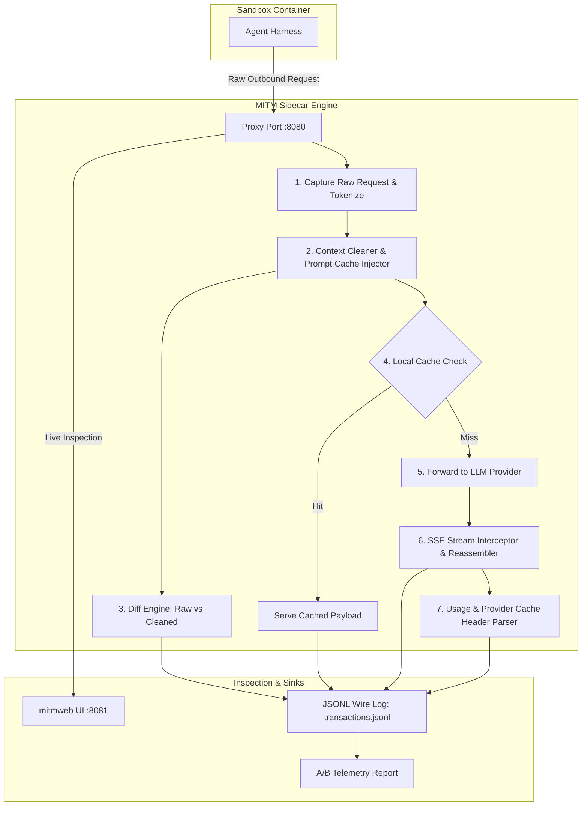
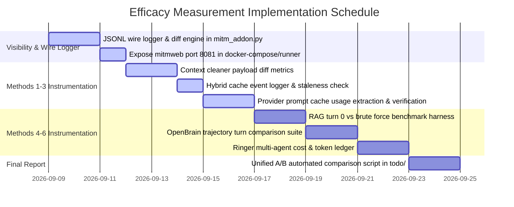

# Token Reduction & Optimization Efficacy Measurement Plan

This document outlines the architecture, instrumentation strategy, and step-by-step methodology for inspecting
wire-level LLM traffic and measuring the empirical effectiveness of all six token reduction techniques across the
`holon-agentic-coder-ref` ecosystem.

> [!NOTE] **Repository Topology & Relative Links**: Relative file paths targeting `../../holon-agentic-coder-ref/...`
> navigate from this document's directory (`docs/optimisation/`) to the repository root where `holon-agentic-coder-ref`
> is located. In standalone GitHub web views, cross-repository relative links do not resolve across separate repository
> boundaries; refer directly to the upstream
> [`holon-agentic-coder-ref`](https://github.com/Holon-Agentic-Coder/holon-agentic-coder-ref) repository.

---

## 🎯 Problem Statement & Diagnostic

### Why Payloads Are Currently Opaque in MITM

During live runs, token counters increment, but developers cannot see the actual requests sent or responses received.
This occurs because:

1. **Summarized Console Logging**:
   [`mitm_addon.py`](../../holon-agentic-coder-ref/develop/apps/sandbox-executor/src/sandbox_executor/token_reduction/mitm_addon.py)
   outputs only single-line `📊 [TELEMETRY]` summaries to standard output.
2. **Streaming (SSE) Buffering Without Inspection Sinks**: When agents stream responses via Server-Sent Events (SSE),
   chunks are assembled in-memory solely to parse usage metadata and count tokens, without emitting the full
   reconstructed text or prompt diffs to disk or console.
3. **Headless Proxy Execution**: In standard Docker sidecar runs, `mitmdump` runs headlessly without a persistent
   transaction log or web UI attached.

### Objectives of This Measurement Plan

1. **100% Wire-Level Visibility**: Capture and log the complete uncleaned request, transformed (cleaned) request, and
   reconstructed upstream response for every turn.
2. **Empirical Measurement Across All 6 Techniques**:
   - **Context Cleaning & Deduplication**
   - **Local Hybrid & Semantic Caching**
   - **Provider Prompt Cache Optimisation**
   - **RAG Codebase Indexer**
   - **OpenBrain Memory Layer**
   - **Ringer Multi-Agent Framework**
3. **Reproducible A/B Verification**: Quantify exact token deltas, financial cost reductions, latency changes, and task
   success rates between baseline and optimized runs.

---

## 🔬 System Architecture for Full Traffic Inspection



---

## 📡 Part 1: Real-Time Request & Response Wire Inspection

To inspect the raw traffic going out and coming back in real time:

### 1. Structured Wire Logger (`todo/mitm_wire_logs/`)

Add a structured file logger to
[`mitm_addon.py`](../../holon-agentic-coder-ref/develop/apps/sandbox-executor/src/sandbox_executor/token_reduction/mitm_addon.py)
that appends full transaction details to `${WIRE_LOG_DIR}/turn_{turn_id}_{flow_id}.json` and
`${WIRE_LOG_DIR}/transactions.jsonl`.

- **Log Directory Parameterization & Git Ignore**: Configure the destination directory via the `WIRE_LOG_DIR`
  environment variable:

  ```python
  WIRE_LOG_DIR = os.getenv("WIRE_LOG_DIR", "todo/mitm_wire_logs")
  ```

  In local development, transactions default to `todo/mitm_wire_logs/`. When running inside Docker containers, pass
  `-e WIRE_LOG_DIR=/tmp/wire_logs` so output writes directly to the mounted `/tmp/wire_logs` host volume. Ensure
  `${WIRE_LOG_DIR}` (e.g. `todo/mitm_wire_logs/`) is explicitly included in `.gitignore` to prevent committing raw
  conversation transcripts, tool outputs, and LLM payloads to source control.

  _Log Retention & Disk Quota Policy_: In long-running benchmark suites ($N \ge 3$ across 50+ turns), full raw
  transaction dumps (`turn_{turn_id}_{flow_id}.json`) can accumulate hundreds of megabytes of disk storage. For
  resource-constrained CI/CD runners, implement a retention policy—such as configuring CI pipeline artifact uploads
  (e.g., `actions/upload-artifact`) with `retention-days: 1` (or uploading only on test failure), archiving runs older
  than 7 days, compressing individual turn dumps into a tarball artifact (`tar -czf wire_logs.tar.gz ${WIRE_LOG_DIR}`),
  or retaining only the compact summary lines in `transactions.jsonl` while purging raw per-turn payload dumps once
  benchmark assertions pass.

- **Turn ID Derivation & Multi-Agent Flow Scoping**: When running multi-agent workflows (such as Method 6 Ringer),
  multiple subagents execute concurrently through `:8080`. HTTP requests arriving at the proxy are stateless; relying
  solely on a naive sequential counter can cause interleaved turn counts across concurrent subagents. To establish
  strict flow correlation and subagent attribution, companion request headers (`X-Holon-Turn-Id`, `X-Holon-Agent-Id`,
  `X-Holon-Agent-Role`) can be supplied directly by the benchmark harness or multi-agent orchestrator. If headers are
  absent, `mitm_addon.py` derives the turn ID using the following precedence order:
  1. **Harness Header**: Extract from explicit request headers if supplied by the test harness (e.g., `X-Holon-Turn-Id`,
     `X-Holon-Agent-Id`, `X-Holon-Agent-Role`).
  2. **Message Depth Counter**: Count conversational assistant completions in the request payload
     (`len([m for m in messages if m.get('role') == 'assistant']) + 1`), which avoids turn jitter during parallel tool
     execution, or count user turns. When `messages` is absent (such as in Google Gemini endpoints), inspect
     `payload.get('contents')` and count model responses (`len([c for c in contents if c.get('role') == 'model']) + 1`)
     or user turns (`len([c for c in contents if c.get('role') == 'user'])`). This ensures turn IDs increment reliably
     across Anthropic (user-wrapped tool results), OpenAI/OpenAI-compatible tool-calling loops (dedicated `tool` role
     turns), and Google Gemini conversational structures.
  3. **Sequence Counter Fallback**: Fallback to an internal per-flow sequential counter.

  Individual transaction dump files are scoped by turn ID and flow or subagent ID (`turn_{turn_id}_{flow_id}.json`) to
  prevent write collisions and file overwrites. Furthermore, disk writes for both individual turn dumps and
  `transactions.jsonl` must use an asynchronous logging queue or thread pool offloading (`asyncio.to_thread` /
  background worker) to prevent blocking the mitmproxy event loop and distorting TTFT and latency metrics.

- **Credential & Secret Sanitization**: In accordance with security best practices, `dump_wire_transaction()` must scrub
  all sensitive credential headers (case-insensitively normalizing names to lowercase: `authorization`, `x-api-key`,
  `api-key`, `x-goog-api-key`, `holon-agent-key`, `proxy-authorization`) by replacing their values with `"[REDACTED]"`.
  In addition, `dump_wire_transaction()` must scrub URL query parameters matching sensitive keys using URL query parser
  logic or regex ``r'(?i)([?&](?:key|api_key|apiKey|token|access_token)=)[^&\s"\'`<>#]+'`` (e.g., stripping Google
  Gemini `?key=...` or non-leading `&key=...` / `&api_key=...` parameter values to `\1[REDACTED]`, avoiding consuming
  closing quotes in JSON strings or URL fragment `#` anchors). Furthermore, to protect against accidental secret leakage
  in agentic workflows (such as an agent inspecting a `.env` file or executing shell commands with tokens),
  `dump_wire_transaction()` must perform deep payload scrubbing across message contents, tool inputs, and tool outputs.
  To avoid regex recompilation overhead across high-throughput message payloads, compile patterns once using
  `re.compile()` for common API key and private certificate signatures:
  - Anthropic API keys: `r'\bsk-ant-[a-zA-Z0-9_\-]+\b'`
  - OpenAI Project, Service Account & User API keys: `r'\bsk-(?:proj-|admin-)?[a-zA-Z0-9_\-]{20,}\b'`
  - Google Cloud / Vertex AI / AI Studio keys: `r'\bAIza[0-9A-Za-z\-_]{35}\b'`
  - GitHub Tokens (PAT, OAuth, App, Refresh): `r'\bgh[pousr]_[a-zA-Z0-9]{36}\b'`, `r'\bgithub_pat_[a-zA-Z0-9_]{82}\b'`
  - AWS Access Key IDs: `r'\bAKIA[0-9A-Z]{16}\b'`, `r'\bASIA[0-9A-Z]{16}\b'`
  - Hugging Face Access Tokens: `r'\bhf_[a-zA-Z0-9]{34,}\b'`
  - JWT Bearer Tokens: `r'\beyJ[a-zA-Z0-9_\-]{20,}\.[a-zA-Z0-9_\-]{20,}\.[a-zA-Z0-9_\-]{20,}\b'`
  - PEM & PGP Private Key Blocks (including PKCS#8):
    `r'-----BEGIN (?:[A-Z\s]+ )?PRIVATE KEY(?: BLOCK)?-----[\s\S]*?-----END (?:[A-Z\s]+ )?PRIVATE KEY(?: BLOCK)?-----'`

  All detected secret matches in message bodies and payloads are replaced with `"[REDACTED_SECRET]"` prior to persisting
  transaction payloads or endpoint URLs to disk.

```json
{
  "turn_id": 4,
  "flow_id": "flow_a1b2c3d4",
  "agent_id": "subagent_executor_01",
  "agent_role": "executor",
  "timestamp": "2026-09-08T21:30:00.000Z",
  "provider": "anthropic",
  "endpoint": "https://api.anthropic.com/v1/messages",
  "headers": {
    "content-type": "application/json",
    "x-api-key": "[REDACTED]",
    "authorization": "[REDACTED]"
  },
  "raw_request": {
    "model": "claude-3-5-sonnet-20241022",
    "messages": [...]
  },
  "cleaned_request": {
    "model": "claude-3-5-sonnet-20241022",
    "messages": [...]
  },
  "delta": {
    "raw_chars": 28450,
    "cleaned_chars": 12100,
    "chars_saved": 16350,
    "tool_outputs_omitted": 2,
    "turns_summarized": 1,
    "cache_control_injected": 3
  },
  "cache_action": "MISS",
  "response": {
    "status": 200,
    "usage": {
      "input_tokens": 3120,
      "cache_creation_input_tokens": 0,
      "cache_read_input_tokens": 2850,
      "output_tokens": 420
    },
    "content": "..."
  },
  "timing": {
    "ttft_ms": 320.5,
    "total_ms": 2450.0
  }
}
```

> [!NOTE] **Anthropic Wire Schema `usage.input_tokens` Semantics**: In raw Anthropic Messages API responses,
> `usage.input_tokens` denotes only _uncached base prompt tokens_ ($3,120 - 2,850 = 270$ tokens in this example). In
> Holon's normalized wire telemetry schema persisted to `transactions.jsonl`, `usage.input_tokens` records the
> comprehensive total prompt token count across all cache tiers:
> $$\text{input\_tokens} = \text{uncached\_input} + \text{cache\_read\_input\_tokens} + \text{cache\_creation\_input\_tokens}$$
> For downstream consumers requiring verbatim upstream provider payloads, raw unnormalized responses remain accessible
> in per-turn dump records (`turn_{turn_id}_{flow_id}.json`).

> [!NOTE] **Schema Timing Metric (`ttft_ms`)**: In the wire transaction schema, `ttft_ms` records Time-To-First-Token
> for streaming SSE responses. For non-streaming synchronous requests, `ttft_ms` is `null` (or equal to `total_ms`).

### 2. Live Web Dashboard (`mitmweb`) & Headless CI Runner (`mitmdump`)

#### Interactive Development (`mitmweb`)

For local development and real-time request inspection, expose `mitmweb` with the web interface on port `8081`:

```bash
# Obtain repository root to ensure mounts are directory-agnostic
REPO_ROOT=$(git rev-parse --show-toplevel)

# Ensure log, cache, and proxy CA directories exist on host prior to container startup
mkdir -p "${REPO_ROOT}/todo/mitm_wire_logs" "${REPO_ROOT}/todo/cache" ~/.holon/proxy-ca

# Tip (Linux hosts): If UID/GID permissions prevent container writes (mitmproxy runs as UID 1000),
# ensure ownership or write permissions via 'chown -R 1000:1000 todo/mitm_wire_logs todo/cache ~/.holon/proxy-ca'
# (or 'chmod -R 775 todo/mitm_wire_logs todo/cache ~/.holon/proxy-ca'). Alternatively, add '--user $(id -u):$(id -g)'
# along with '-e HOME=/tmp' and mount '-v ~/.holon/proxy-ca:/tmp/.mitmproxy' (or pass '--set confdir=/tmp/.mitmproxy')
# since mitmproxy resolves its default configuration under '$HOME/.mitmproxy'.

docker run --rm -it \
  -p 127.0.0.1:8080:8080 \
  -p 127.0.0.1:8081:8081 \
  -e WIRE_LOG_DIR=/tmp/wire_logs \
  -e CACHE_DIR=/tmp/cache \
  -e PYTHONPATH=/tmp/src \
  -v "${REPO_ROOT}/holon-agentic-coder-ref/develop/apps/sandbox-executor/src":/tmp/src:ro \
  -v "${REPO_ROOT}/holon-agentic-coder-ref/develop/apps/sandbox-executor/src/sandbox_executor/token_reduction/mitm_addon.py":/tmp/mitm_addon.py:ro \
  -v "${REPO_ROOT}/todo/mitm_wire_logs":/tmp/wire_logs \
  -v "${REPO_ROOT}/todo/cache":/tmp/cache \
  -v ~/.holon/proxy-ca:/home/mitmproxy/.mitmproxy \
  mitmproxy/mitmproxy:12.2.3 \
  mitmweb -s /tmp/mitm_addon.py --web-host 0.0.0.0 --web-port 8081 --listen-port 8080 \
  --set ignore_hosts='^(api\.github\.com|github\.com):443$'
```

- Navigate to `http://localhost:8081` in your browser.
- Every HTTP request, modified body, diff view, SSE event stream, and header will be interactively visualizable and
  inspectable in real time.

#### Automated CI/CD Headless Execution (`mitmdump`)

In automated CI/CD runner pipelines (e.g., GitHub Actions, GitLab CI), interactive pseudo-TTY allocation (`-it`) and
long-lived web UIs can block pipeline execution. Launch `mitmdump` in detached mode (`-d`) without the web interface:

```bash
# Headless detached container execution for CI/CD runner environments
REPO_ROOT=$(git rev-parse --show-toplevel)
mkdir -p "${REPO_ROOT}/todo/mitm_wire_logs" "${REPO_ROOT}/todo/cache" ~/.holon/proxy-ca
chmod -R 777 "${REPO_ROOT}/todo/mitm_wire_logs" "${REPO_ROOT}/todo/cache" ~/.holon/proxy-ca 2>/dev/null || true
docker rm -f mitmproxy-wire-logger 2>/dev/null || true
trap 'docker rm -f mitmproxy-wire-logger >/dev/null 2>&1 || true' EXIT INT TERM

docker run -d --name mitmproxy-wire-logger \
  -p 127.0.0.1:8080:8080 \
  -e WIRE_LOG_DIR=/tmp/wire_logs \
  -e CACHE_DIR=/tmp/cache \
  -e PYTHONPATH=/tmp/src \
  -v "${REPO_ROOT}/holon-agentic-coder-ref/develop/apps/sandbox-executor/src":/tmp/src:ro \
  -v "${REPO_ROOT}/holon-agentic-coder-ref/develop/apps/sandbox-executor/src/sandbox_executor/token_reduction/mitm_addon.py":/tmp/mitm_addon.py:ro \
  -v "${REPO_ROOT}/todo/mitm_wire_logs":/tmp/wire_logs \
  -v "${REPO_ROOT}/todo/cache":/tmp/cache \
  -v ~/.holon/proxy-ca:/home/mitmproxy/.mitmproxy \
  mitmproxy/mitmproxy:12.2.3 \
  mitmdump -s /tmp/mitm_addon.py --listen-port 8080 \
  --set ignore_hosts='^(api\.github\.com|github\.com):443$'

# CI readiness healthcheck probe: verify proxy socket is actively accepting traffic before launching test harnesses
# TIMEOUT=50 represents 50 retry attempts (~10s at 0.2s sleep intervals under fast socket refusal)
TIMEOUT=50
COUNT=0
until curl -s --fail --connect-timeout 1 --max-time 2 -x http://127.0.0.1:8080 http://mitm.it > /dev/null; do
  sleep 0.2
  COUNT=$((COUNT + 1))
  if [ "$COUNT" -ge "$TIMEOUT" ]; then
    echo "❌ Error: mitmproxy wire logger failed to become ready on port 8080 after 50 retry attempts (~10s)" >&2
    docker logs mitmproxy-wire-logger
    exit 1
  fi
done
```

> [!NOTE] **CI Workflow Teardown (`if: always()`)**: While `trap ... EXIT INT TERM` cleans up the sidecar container
> during single-script executions, multi-step CI workflows (e.g., GitHub Actions) execute each `run:` step in an
> independent subshell where an `EXIT` trap triggers immediately when the setup step completes. In multi-step pipelines,
> configure container teardown in a dedicated post-execution step using `if: always()`:
>
> ```yaml
> - name: Stop Proxy Sidecar
>   if: always()
>   run: docker rm -f mitmproxy-wire-logger || true
> ```

> [!NOTE] **Security Advisory**: Ports `8080` and `8081` are bound to loopback `127.0.0.1` by default. If binding to an
> external network interface (e.g., in shared staging or remote environments), pass `--web-password <PASSWORD>` (or
> `--set web_password=<PASSWORD>`) to `mitmweb` to prevent unauthorized inspection of captured payloads and credentials.

---

## 📊 Part 2: Measuring the 6 Token Reduction Methods

| Method                      | Primary Target                          | Measurement Metric                                          | Instrumentation Point                                |
| :-------------------------- | :-------------------------------------- | :---------------------------------------------------------- | :--------------------------------------------------- |
| **1. Context Cleaning**     | Redundant tool outputs ($O(N^2)$ bloat) | Chars/tokens pruned; omitted blocks count; context slope    | Pre- vs Post-cleaning request payload comparison     |
| **2. Local Cache**          | Repeated identical/equivalent queries   | Cache hit rate; short-circuited API calls; zero-token turns | SQLite cache queries & short-circuit response branch |
| **3. Prompt Cache Optim.**  | Upstream input prompt re-processing     | Provider `cache_read_tokens` vs total input tokens; $ saved | Provider usage metadata & response headers           |
| **4. RAG Codebase Indexer** | Repository context explosion at turn 0  | Turn 0 prompt token count; search tool calls; precision     | Initial plan prompt size & tool invocation counters  |
| **5. OpenBrain Memory**     | Redundant exploration & trial-and-error | Session turns to completion; injected memory tokens         | Memory injection size & trajectory turn count        |
| **6. Ringer Framework**     | Expensive model token burn on execution | Architect tokens vs Subagent tokens; total $ cost           | Multi-agent token accounting by model tier           |

---

### Method 1: Context Cleaning & Deduplication

#### What to Measure:

1. **Raw vs Cleaned Payload Size**: Difference in character count and estimated token count before and after cleaning.
2. **Deduplication Rate**: Number of repeated `tool_result` items replaced by reference markers
   (`[Omitted: Tool result content is identical to Turn X]`).
3. **Context Growth Trajectory**: Plot of token count per turn across a 30-turn agent session comparing uncleaned
   baseline vs cleaned run.
4. **Accuracy Preservation**: Verification that the agent did not fail or repeat commands due to missing omitted
   content.

#### Measurement Formula:

$$\text{Cleaning Reduction Ratio} = \frac{\text{Tokens}_{\text{raw}} - \text{Tokens}_{\text{cleaned}}}{\text{Tokens}_{\text{raw}}} \times 100\%$$

_(with denominator guard: defaults to $0.0\%$ if $\text{Tokens}_{\text{raw}} = 0$)_

> [!NOTE] **Tokenizer Discrepancy & Heuristics vs Exact Counts**: While character heuristic counters (e.g., ~4
> chars/token) provide lightweight, zero-overhead telemetry within the proxy event loop for real-time diffing, official
> token reduction percentages and benchmark scorecards must be computed using provider token counters (or exact BPE
> tokenizers like `tiktoken` or Hugging Face `tokenizers`) to account for token boundary merges and formatting token
> overhead.

#### Instrumentation:

- In
  [`mitm_addon.py`](../../holon-agentic-coder-ref/develop/apps/sandbox-executor/src/sandbox_executor/token_reduction/mitm_addon.py):`request()`,
  calculate hash and length of `data` (incoming) vs `cleaned_data` (outgoing).
- Emit a `CLEANER_METRICS` event standardized to match wire schema `delta` properties:
  - `chars_saved` (net character reduction: `raw_chars - cleaned_chars`)
  - `tool_outputs_omitted` (count of pruned tool execution blocks)
  - `turns_summarized` (count of historical conversation turns condensed)
  - `cache_control_injected` (count of provider cache breakpoint blocks added)

---

### Method 2: Local & Semantic Cache

> [!NOTE] **Streaming Request Bypass & Cache Evaluation Constraint**: In the current implementation of
> [`mitm_addon.py`](../../holon-agentic-coder-ref/develop/apps/sandbox-executor/src/sandbox_executor/token_reduction/mitm_addon.py),
> streaming requests (`stream: true` or SSE endpoints) bypass local cache storage and retrieval (`put()` and `get()`)
> because returning cached completions requires token-by-token stream replay. Therefore, when evaluating Method 2
> (_Local Hybrid & Semantic Caching_) in benchmarks, agent harnesses must be configured in non-streaming mode to observe
> cache hits and short-circuited token savings. Synthetic SSE stream replay for cached responses is planned for a future
> iteration.

#### What to Measure:

1. **Exact Cache Hit Rate**: Percentage of requests served directly from SQLite without outbound network calls.
2. **Semantic Similarity Hit Rate**: Count of queries matched via Jaccard/embedding similarity above threshold
   ($> 0.85$).
3. **Short-Circuited Token Savings**: Cumulative API prompt and completion tokens avoided ($100\%$ discount on hits).
4. **Staleness / Error Rate**: Frequency of cache invalidations or faulty tool actions caused by replaying previous
   responses.

#### Measurement Formula:

$$\text{Local Cache Hit Rate} = \frac{\text{Requests}_{\text{cached}}}{\text{Requests}_{\text{total}}} \times 100\%$$

_(with denominator guard: defaults to $0.0\%$ if $\text{Requests}_{\text{total}} = 0$)_

$$\text{Tokens Avoided} = \sum_{\text{cache hits}} (\text{Prompt Tokens} + \text{Completion Tokens})$$

#### Instrumentation:

- In
  [`hybrid_cache.py`](../../holon-agentic-coder-ref/develop/apps/sandbox-executor/src/sandbox_executor/token_reduction/hybrid_cache.py):`get()`,
  log cache query results with `key`, `hit_type` (`EXACT`, `SEMANTIC`, `MISS`), `similarity_score`, and `hit_count`.

---

### Method 3: Provider Prompt Cache Optimisation

#### What to Measure:

1. **Provider Cache Read Tokens**: Number of prompt tokens billed at the cached rate (e.g., Anthropic
   `cache_read_input_tokens`, OpenAI `cached_tokens`).
2. **Provider Cache Creation Tokens**: Tokens billed for establishing cache breakpoints (`cache_creation_input_tokens`).
3. **Net Cost Reduction**: True dollar cost savings based on provider pricing tiers.
4. **Breakpoint Invalidation Rate**: Frequency of cache misses caused by mutated prefixes.

#### Measurement Formula:

$$\text{Prompt Cache Efficiency} = \frac{\text{Cache Read Tokens}}{\text{Total Input Tokens}} \times 100\%$$

_(with denominator guard: defaults to $0.0\%$ if $\text{Total Input Tokens} = 0$)_

$$\text{Net Monetary Savings (USD)} = \frac{1}{10^6} \left[ \left(\text{Cache Read Tokens} \times (\text{Price}_{\text{base}} - \text{Price}_{\text{read}})\right) - \left(\text{Cache Creation Tokens} \times (\text{Price}_{\text{create}} - \text{Price}_{\text{base}})\right) \right]$$

_Where $\text{Price}$ is quoted in USD per million tokens (MTok), scaled by the dimensional factor $\frac{1}{10^6}$ to
yield cost in USD. Example for Claude 3.5 Sonnet: Base input price is \$3.00/MTok, cache read is \$0.30/MTok (90%
discount, saving \$2.70/MTok read), while cache creation incurs a 25% surcharge at \$3.75/MTok (costing \$0.75/MTok
extra). Net monetary savings accounts for both read discounts and cache write overhead. Note that for OpenAI automatic
prompt caching, there is no write surcharge: $(\text{Price}_{\text{create}} - \text{Price}_{\text{base}}) = 0$,
simplifying net monetary savings strictly to cache read discounts._

> [!NOTE] **Provider Minimum Prompt Caching Token Thresholds**: Frontier LLM providers enforce minimum prompt token
> thresholds before prompt caching activates. Anthropic requires a minimum of 1,024 prompt tokens for Claude 3.5 Sonnet
> (and 2,048 tokens for Claude 3 Opus and Claude 3 Haiku) before `cache_control` breakpoints are cached. Similarly,
> OpenAI enforces a minimum prompt prefix threshold of 1,024 tokens before automatic prompt caching takes effect. In
> micro-benchmarks or early agent turns where cumulative prompt context is below these thresholds, upstream providers
> will return `cache_read_input_tokens: 0` (or `cached_tokens: 0`) and `cache_creation_input_tokens: 0` even when cache
> breakpoints are properly injected. Ensure benchmark test suites provide sufficient baseline prompt context (system
> prompts, tool definitions, initial conversation history) to exceed provider thresholds and prevent misdiagnosing zero
> cache reads as an instrumentation defect.

> [!WARNING] **Anthropic 5-Minute Ephemeral Cache TTL Window**: Frontier providers such as Anthropic enforce an
> ephemeral 5-minute Time-To-Live (TTL) on prompt cache entries, refreshed upon each cache hit. In agentic workflows
> where individual turns execute slow test suites, large compilation steps, or complex sandbox operations exceeding 5
> minutes, upstream cache breakpoints expire. Subsequent requests will incur unexpected `cache_creation_input_tokens`
> surcharges (25% higher than base input tokens) rather than the anticipated 90% `cache_read_input_tokens` discount.
> Benchmark harnesses and agent orchestrators must keep inter-turn execution latency under 5 minutes or explicitly model
> cache TTL expiration when evaluating long-running trajectories.

#### Instrumentation:

- In
  [`mitm_addon.py`](../../holon-agentic-coder-ref/develop/apps/sandbox-executor/src/sandbox_executor/token_reduction/mitm_addon.py):`extract_token_counts()`,
  parse the exact usage dictionary from JSON or SSE chunks.
- Validate that `cache_control` breakpoints were injected and honored by the upstream provider.

---

### Method 4: RAG Codebase Indexer (Graph + BM25)

#### What to Measure:

1. **Turn 0 Context Size**: Token size of the initial prompt sent to the agent with RAG selective injection vs naive
   full-repo dump.
2. **Exploration Efficiency**: Number of tool calls (`view_file`, `grep_search`) needed by the agent to locate target
   code.
3. **Relevance Ratio**: Percentage of injected AST/BM25 snippets that were actually referenced or edited during the
   task.

#### Measurement Formula:

$$\text{Turn 0 Token Reduction} = \frac{\text{Tokens}_{\text{naive\_repo}} - \text{Tokens}_{\text{rag\_injected}}}{\text{Tokens}_{\text{naive\_repo}}} \times 100\%$$

_(with denominator guard: defaults to $0.0\%$ if $\text{Tokens}_{\text{naive\_repo}} = 0$)_

$$\text{Net RAG Trajectory Savings} = \sum \text{Tokens}_{\text{naive\_session}} - \sum \text{Tokens}_{\text{rag\_session}}$$

_Trajectory Trade-Off Evaluation_: While the Turn 0 formula measures initial prompt pruning efficiency, aggressive
Turn-0 pruning risks forcing an agent into exploratory thrashing (invoking excessive `grep_search`, `view_file`, or
`find_by_name` tool calls during mid-trajectory execution). Tracking $\text{Net RAG Trajectory Savings}$ across complete
sessions confirms whether Turn-0 reductions translate into true net token and monetary savings over the entire task
lifecycle.

#### Instrumentation:

- In
  [`rag_indexer.py`](../../holon-agentic-coder-ref/develop/apps/sandbox-executor/src/sandbox_executor/token_reduction/rag_indexer.py),
  log the token count of generated context blocks.
- Track agent tool invocations (`grep`, `find`, `semantic_search`) during the execution phase.

---

### Method 5: OpenBrain Memory Layer (Episodic Continuity)

#### What to Measure:

1. **Turn Count to Completion**: Total turns required to solve a problem with existing OpenBrain lessons vs without
   memory (cold start).
2. **Memory Token Overhead**: Number of prompt tokens consumed by injected episodic memories.
3. **Trial-and-Error Reduction**: Number of failed command executions or syntax errors avoided due to retrieved memory.

#### Measurement Formula:

$$\Delta \text{Turns} = \text{Turns}_{\text{cold\_start}} - \text{Turns}_{\text{with\_memory}}$$

$$\text{Net Tokens Saved} = \sum \text{Tokens}_{\text{cold\_start}} - \sum \text{Tokens}_{\text{with\_memory}}$$

$$\text{Token ROI (Ratio)} = \frac{\sum \text{Tokens}_{\text{cold\_start}} - \sum \text{Tokens}_{\text{with\_memory}}}{\sum \text{Tokens}_{\text{memory\_injected}}}$$

_(with denominator guard: defaults to $0.0$ if $\sum \text{Tokens}_{\text{memory\_injected}} = 0$)_

_Note on Ephemeral vs Persistent Context Overhead_: In multi-turn chat architectures, prompt context grows monotonically
($O(N)$ or $O(N^2)$ prompt accumulation), making turns saved toward the end of an execution trajectory yield
significantly higher token reductions than early or average turns. Because $\sum \text{Tokens}_{\text{with\_memory}}$
already incorporates the injected memory tokens present in the trajectory's prompts, defining Net Tokens Saved as
$\sum \text{Tokens}_{\text{cold\_start}} - \sum \text{Tokens}_{\text{with\_memory}}$ avoids double-counting the memory
overhead. Meanwhile, Token ROI measures the efficiency ratio of net tokens saved per injected memory token.
Additionally, when episodic memories are injected ephemerally (retrieved on-demand for a single turn or tool execution),
$\sum \text{Tokens}_{\text{memory\_injected}}$ is incurred only once. Conversely, if injected into persistent system
prompts or Turn-0 context, the memory tokens recur across all subsequent turns
($N \times \text{Tokens}_{\text{memory\_injected}}$) unless amortized by provider prompt caching. The cumulative
trajectory formula directly captures this distinction without relying on imprecise per-turn averages.

#### Instrumentation:

- In
  [`openbrain_memory.py`](../../holon-agentic-coder-ref/develop/apps/sandbox-executor/src/sandbox_executor/token_reduction/openbrain_memory.py),
  log retrieved memory IDs, similarity scores, and injected token counts.
- Compare task success speed on regression benchmark suites.

---

### Method 6: Ringer Framework (Architect / Executor Hierarchy)

#### What to Measure:

1. **Tiered Model Token Split**: Ratio of tokens consumed on Tier 1 Architect models (e.g., Claude 3.5 Sonnet @
   \$3.00/MTok) vs Tier 2 Executor models (e.g., Gemini 2.5 Flash @ \$0.10/MTok).
2. **Subagent Context Compression**: Token size of raw executor tool logs vs compressed summary returned to the
   architect.
3. **Composite Financial Cost**: Total cost per completed task under Ringer vs a monolithic single-agent setup.
4. **Trajectory Wall-Clock Time ($T_{\text{wall}}$)**: Total elapsed execution time across the trajectory to evaluate
   parallel subagent concurrency speedups versus inter-agent coordination overhead.

#### Measurement Formula:

$$\text{Cost}_{\text{monolithic}} = \frac{1}{10^6} \left[ (\text{Tokens}_{\text{in, total}} \times \text{Price}_{\text{in, arch}}) + (\text{Tokens}_{\text{out, total}} \times \text{Price}_{\text{out, arch}}) \right]$$

$$\text{Cost}_{\text{ringer}} = \frac{1}{10^6} \left[ (\text{Tokens}_{\text{in, arch}} \times \text{Price}_{\text{in, arch}} + \text{Tokens}_{\text{out, arch}} \times \text{Price}_{\text{out, arch}}) + \sum_i (\text{Tokens}_{\text{in, exec}_i} \times \text{Price}_{\text{in, exec}_i} + \text{Tokens}_{\text{out, exec}_i} \times \text{Price}_{\text{out, exec}_i}) \right]$$

_Where $\text{Price}$ is quoted in USD per million tokens (MTok), scaled by the dimensional factor $\frac{1}{10^6}$ to
yield cost in USD. Differentiating input and output token pricing is critical because completion tokens are typically 3×
to 5× more expensive than prompt tokens across both Tier 1 (e.g., Claude 3.5 Sonnet: \$3.00/MTok input vs \$15.00/MTok
output) and Tier 2 models (e.g., Gemini 2.5 Flash: \$0.10/MTok input vs \$0.40/MTok output)._

#### Instrumentation:

- In
  [`ringer_orchestrator.py`](../../holon-agentic-coder-ref/develop/apps/sandbox-executor/src/sandbox_executor/token_reduction/ringer_orchestrator.py),
  record separate token ledgers for the architect and each subagent child conversation.
- Measure compression ratio: $\frac{\text{Tokens}_{\text{summary}}}{\text{Tokens}_{\text{raw\_subagent\_history}}}$
  _(with denominator guard: defaults to $0.0$ if $\text{Tokens}_{\text{raw\_subagent\_history}} = 0$)_.

---

## 📈 Part 3: Unified Efficacy Scorecard

To ensure statistical rigor and eliminate non-deterministic path variance across frontier LLM trajectories (such as
differing exploration paths or tool call sequences), benchmark evaluations must fix `temperature: 0.0`, configure a
deterministic seed parameter (e.g., `seed: 42` for providers supporting deterministic sampling controls), and execute
$N \ge 3$ iterations per task suite with workspace state resetting (`git clean -fdx` or sandbox container
re-initialization) between runs. The unified scorecard reports sample mean values ($\mu$) and standard deviations
($\sigma$) across both baseline (unoptimized) and fully optimized runs on an identical standard task (e.g., executing a
multi-file refactoring or bug fix). In addition to prompt tokens, cumulative output tokens are tracked explicitly to
account for provider completion pricing tiers (3× to 5× higher than input pricing). Furthermore, a **Task Success Rate /
Test Pass Rate** operational guardrail is mandated to guarantee that aggressive token reduction strategies never
compromise functional correctness or software quality:

```markdown
# Token Reduction Efficacy Scorecard

### Run Metadata

- Task: Refactor auth middleware & add unit tests
- Agent Harness: Antigravity / Claude
- Sampling Temperature: 0.0 (seed: 42)
- Iterations: N = 3 (reported as mean ± std dev)
- Streaming: Disabled (for Method 2 local cache evaluation)
- Total Turns: 18 ± 0.8

### Metrics Comparison Table

| Metric                                 | Baseline (Direct) | Optimized (All 6 Active) | Net Impact                                      |
| :------------------------------------- | :---------------- | :----------------------- | :---------------------------------------------- |
| **Task Success Rate / Test Pass Rate** | 100% (3/3 pass)   | 100% (3/3 pass)          | **100% (Functional correctness guardrail met)** |
| **Total Prompt Tokens (Cumulative)**   | 262,500 ± 3,800   | 48,200 ± 850             | **-81.6% (-214,300 tok)**                       |
| **Total Output Tokens (Cumulative)**   | 4,850 ± 120       | 3,920 ± 90               | **-19.2% (-930 tok)**                           |
| **Turn 0 Context Injection**           | 18,400 ± 0        | 2,800 ± 0 (RAG)          | **-84.8% (-15,600 tok)**                        |
| **Tool Output Redundancy Pruned**      | 0 bytes           | 42,600 ± 1,200 bytes     | **12 duplicate file reads omitted**             |
| **Provider Prompt Cache Hit Rate**     | 0%                | 78.4% ± 1.5%             | **37,788 tokens billed at 90% discount**        |
| **Local Cache Short-Circuits**         | 0 calls           | 2 calls                  | **2 calls (11%) served at 0 tokens**            |
| **Architect / Executor Token Split**   | 100% Sonnet       | 25% Sonnet / 75% Flash   | **75% of execution delegated to cheap tier**    |
| **Episodic Memory Turns Saved**        | 0 turns           | 3 turns                  | **Setup error avoided via OpenBrain memory**    |
| **Total Monetary Cost**                | **$0.86 ± $0.02** | **$0.14 ± $0.01**        | **-83.7% ($0.72 saved per task)**               |

> [!NOTE] **Scorecard Financial Accounting Note**: Baseline and optimized monetary costs model cumulative multi-turn
> prompt token accumulation and cache creation write surcharges across the 18 session turns. Illustrative rates assume
> Tier 1 Claude 3.5 Sonnet ($3.00 in / $15.00 out / $3.75 create / $0.30 read per MTok) and Tier 2 Gemini 2.5 Flash
> ($0.10 in / $0.40 out per MTok).
```

---

## 🚀 Part 4: Implementation Roadmap



### Action Items:

1. **Update
   [`mitm_addon.py`](../../holon-agentic-coder-ref/develop/apps/sandbox-executor/src/sandbox_executor/token_reduction/mitm_addon.py)**:
   - Parameterize log directory using `WIRE_LOG_DIR` environment variable (default: `todo/mitm_wire_logs/`) and cache
     directory using `CACHE_DIR` environment variable (default: `~/.holon/cache/`) so SQLite cache persistence can be
     mapped to host directories (`-e CACHE_DIR=/tmp/cache -v "${REPO_ROOT}/todo/cache":/tmp/cache`).
   - Implement `dump_wire_transaction()` to write full raw request, cleaned request, and response payloads to
     `${WIRE_LOG_DIR}/turn_{turn_id}_{flow_id}.json` and atomic line appends to `${WIRE_LOG_DIR}/transactions.jsonl`,
     offloaded via an asynchronous logging queue or thread pool (`asyncio.to_thread` / background worker) to prevent
     blocking the mitmproxy event loop.
   - Scrub sensitive credentials and authentication headers (case-insensitively normalizing names to lowercase:
     `authorization`, `x-api-key`, `api-key`, `x-goog-api-key`, `holon-agent-key`, `proxy-authorization`) and URL query
     parameters via query parser logic or regex
     ``r'(?i)([?&](?:key|api_key|apiKey|token|access_token)=)[^&\s"\'`<>#]+'`` with `[REDACTED]`.
   - Deep-scrub message bodies and tool payloads using word-boundary regex patterns for API keys and tokens (Anthropic
     `sk-ant-...`, OpenAI `r'\bsk-(?:proj-|admin-)?[a-zA-Z0-9_\-]{20,}\b'`, Google Cloud / Vertex AI
     `r'\bAIza[0-9A-Za-z\-_]{35}\b'`, GitHub tokens `r'\bgh[pousr]_[a-zA-Z0-9]{36}\b'` / `github_pat_...`, AWS `AKIA...`
     / `ASIA...`, Hugging Face tokens `r'\bhf_[a-zA-Z0-9]{34,}\b'`, JWT Bearer tokens
     `r'\beyJ[a-zA-Z0-9_\-]{20,}\.[a-zA-Z0-9_\-]{20,}\.[a-zA-Z0-9_\-]{20,}\b'`, and PEM/PGP private key blocks including
     PKCS#8
     `r'-----BEGIN (?:[A-Z\s]+ )?PRIVATE KEY(?: BLOCK)?-----[\s\S]*?-----END (?:[A-Z\s]+ )?PRIVATE KEY(?: BLOCK)?-----'`),
     replacing detected secrets with `[REDACTED_SECRET]` before persisting transaction payloads or endpoint URLs to
     disk.
   - Ensure SSE stream accumulation decodes and writes the complete final assistant message to the transaction record.
2. **Update Runner CLI**:
   - Add flag `--mitm-web` to launch `mitmweb` instead of `mitmdump` with web port `8081` bound to localhost.
3. **Implement A/B Benchmark Script**:
   - Provide an automated runner in `todo/ab_measure_all_methods.py` that enforces a benchmark pre-clean step:
     explicitly purging or isolating the SQLite cache database (`llm_cache.db` / `~/.holon/cache/` /
     `hybrid_cache.sqlite` via parameterized `CACHE_DIR`) alongside archiving previous `${WIRE_LOG_DIR}` transaction
     logs before benchmark runs to prevent residual cache hits from distorting baseline measurements.
   - Mandate resetting workspace state between benchmark iterations (via `git clean -fdx` or sandbox container
     re-initialization) to guarantee that each run begins from a pristine repository state without inheriting modified
     files from earlier turns, ensuring statistical independence across $N \ge 3$ iterations.
   - Execute $N \ge 3$ iterations at fixed `temperature: 0.0` with `seed: 42`, aggregate mean ($\mu$) and standard
     deviation ($\sigma$) metrics, verify the task success rate guardrail by evaluating sandbox test execution exit
     codes (`pytest` returncode == 0), and print the completed Efficacy Scorecard.
