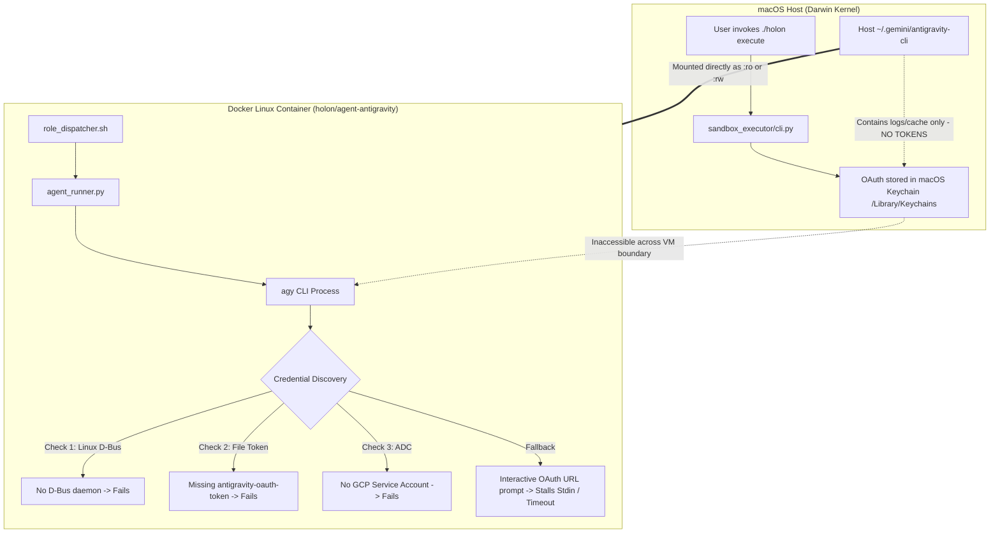

# Executing Antigravity CLI (`agy`) within Sandbox Environments (Linux & macOS Hosts)

This document provides the definitive architecture, authentication behavior, empirical findings, and concrete solutions
for executing the Antigravity AI coding agent CLI (`agy`) inside containerized Docker sandbox environments
(`holon/agent-antigravity`) on both **Linux** and **macOS** hosts.

---

## 🎯 Background & Problem Statement

In the Holon Agentic Coder architecture, the **Sandbox Executor** runs coding agent CLIs (`agy`, `claude`, `pi`,
`codex`, `opencode`) inside isolated Docker containers to implement plans, run tests, and commit changes.

When running non-Google agents (`claude`, `codex`, etc.), authentication is straightforward: stateless API keys
(`ANTHROPIC_API_KEY`, `OPENAI_API_KEY`) are passed via environment variables, enabling automated headless execution
without user prompts.

However, executing `agy` inside headless Docker containers presents unique authentication requirements based on plan
types (Individual vs. Enterprise) and OS-level credential storage boundaries.

---

## 🔍 Verification of Authentication & Plan Taxonomy

Antigravity (`agy`) distinguishes between **Individual / Subscription Plans** (Free, Google AI Pro, Google AI Ultra) and
**Enterprise Cloud Plans** (Gemini Enterprise / Vertex AI Agent Platform):

| Plan Tier                                 | Primary Billing & Identity                                              | Authentication Protocol                                      | Credential Storage Mechanism                                                           | Sandbox Applicability                                       |
| :---------------------------------------- | :---------------------------------------------------------------------- | :----------------------------------------------------------- | :------------------------------------------------------------------------------------- | :---------------------------------------------------------- |
| **Individual Plans (e.g. Google AI Pro)** | $20/month subscription linked to personal Google account (`@gmail.com`) | **Personal OAuth 2.0 PKCE (`oauth-personal`)**               | **OS Keyring**: Apple Keychain (macOS) / FreeDesktop Secret Service over D-Bus (Linux) | **Requires Dedicated Sandbox Session or D-Bus Mount**       |
| **Gemini Enterprise (Cloud)**             | Consumption-based pay-as-you-go linked to GCP project                   | **Application Default Credentials (`oauth-business` / ADC)** | Service Account Key JSON / `~/.config/gcloud/`                                         | **Supported natively via `GOOGLE_APPLICATION_CREDENTIALS`** |

---

## 🏗️ Technical Blockers on macOS Hosts



### Key Failure Modes:

1. **Cross-OS Keyring Isolation (macOS Hosts)**: On macOS, `agy` compiles
   [`zalando/go-keyring`](https://github.com/zalando/go-keyring) (`keyring_darwin.go`) and persists OAuth tokens
   directly into the macOS **Apple Keychain** (`login.keychain-db`). Because Docker Desktop runs containers inside a
   LinuxKit VM, the container cannot reach the host's Apple Keychain. Mounting the host's `~/.gemini/antigravity-cli`
   only provides logs and cache—**it contains zero authentication tokens**.

2. **Non-Interactive Stdin Blocking**: When `agy` runs in headless print mode (`-p`), unauthenticated execution causes
   it to prompt for browser login and wait for code input on `stdin`, stalling automated container runners.

3. **Directory Hierarchy & Permissions (`.gemini/config`)**: `agy` expects two sibling directories:
   `~/.gemini/antigravity-cli` (application data) and `~/.gemini/config/projects` (project state). Mounting only
   `antigravity-cli` causes Docker to create `/home/holon/.gemini` as `root:root`, preventing the container user
   (`holon`, `uid=1000`) from creating the required config directories.

---

## 💡 Evaluated Solutions for Google AI Pro

---

### 🌟 Solution 1: Dedicated Isolated Sandbox Session (Universal & Recommended)

_Provides clean sandbox quarantine without touching the host's macOS Keychain._

- **Architecture**: A dedicated directory on the host (`~/.holon/sessions/antigravity/`) is mapped to
  `/home/holon/.gemini` inside the container.
- **One-Time Onboarding**: The developer authenticates once inside an interactive container:
  ```bash
  docker run -it -v ~/.holon/sessions/antigravity:/home/holon/.gemini:rw holon/agent-antigravity agy
  ```
  This creates the Linux-native token file `/home/holon/.gemini/antigravity-cli/antigravity-oauth-token`.
- **Autonomous Execution**: All subsequent headless agent runs bind-mount the directory:
  ```bash
  docker run --rm \
    -v ~/.holon/sessions/antigravity:/home/holon/.gemini:rw \
    holon/agent-antigravity \
    agy --dangerously-skip-permissions -p "Your prompt here"
  ```
- **Pros**:
  - **Maximum Security**: Quarantines container credentials completely from the host system Keychain.
  - **Parity**: Identical to how `claude` (`~/.config/claude`), `codex` (`~/.codex`), and `pi` (`~/.config/pi`) operate.
  - **Cross-Platform**: Works identically on macOS, Linux, and remote Docker daemons.
- **Cons**:
  - Requires a one-time interactive login command when setting up a new development machine.

---

### 🍏 Solution 2: Automated macOS Keychain Extraction Bridge

_For developers desiring zero-touch authentication inheriting from the host macOS session._

- **Architecture**: A host pre-execution hook queries the macOS Keychain via `/usr/bin/security`, extracts the
  `gemini`/`antigravity` password item, strips the `go-keyring-base64:` envelope, and writes the plain JSON into a
  temporary runtime directory (`/tmp/holon_antigravity_runtime/antigravity-cli/antigravity-oauth-token`).
- **Python Bridge Script**:
  ```python
  import base64
  import os
  import shutil
  import subprocess
  import sys


  def prepare_antigravity_session() -> str:
      """Extracts macOS keychain token and prepares a container-ready .gemini directory."""
      target_dir = "/tmp/holon_antigravity_runtime"
      os.makedirs(f"{target_dir}/antigravity-cli", exist_ok=True)
      os.makedirs(f"{target_dir}/config/projects", exist_ok=True)

      host_dir = os.path.expanduser("~/.gemini/antigravity-cli")
      if os.path.exists(host_dir):
          for item in os.listdir(host_dir):
              s = os.path.join(host_dir, item)
              d = os.path.join(target_dir, "antigravity-cli", item)
              if item in ("settings.json", "cache", "builtin"):
                  if os.path.isdir(s):
                      shutil.copytree(s, d, dirs_exist_ok=True)
                  else:
                      shutil.copy2(s, d)

      if sys.platform == "darwin":
          try:
              raw = (
                  subprocess.check_output(
                      [
                          "security",
                          "find-generic-password",
                          "-s",
                          "gemini",
                          "-a",
                          "antigravity",
                          "-w",
                      ],
                      stderr=subprocess.DEVNULL,
                  )
                  .decode()
                  .strip()
              )

              if raw.startswith("go-keyring-base64:"):
                  token_bytes = base64.b64decode(
                      raw[len("go-keyring-base64:") :]
                  )
                  token_file = os.path.join(
                      target_dir, "antigravity-cli", "antigravity-oauth-token"
                  )
                  with open(token_file, "wb") as f:
                      f.write(token_bytes)
          except Exception:
              pass

      return target_dir
  ```

````
- **Pros**: Zero-touch; automatically syncs active host login.
- **Cons**: Programmatically accesses host's system Keychain; dependent on undocumented internal label schemas (`gemini`/`antigravity`).

---

### 🐧 Solution 3: Linux Host — D-Bus Session Socket Mount

_Applicable for native Linux development hosts._

- **Architecture**: Bind-mount the active user D-Bus session socket into the container:
  ```bash
  docker run --rm \
    -v /run/user/${UID}/bus:/run/user/1000/bus \
    -e DBUS_SESSION_BUS_ADDRESS="unix:path=/run/user/1000/bus" \
    -v ~/.gemini:/home/holon/.gemini:rw \
    holon/agent-antigravity agy --dangerously-skip-permissions -p "..."
````

- **Pros**: Reuses the active developer desktop login without provisioning files or API keys.
- **Cons**: Linux-specific; does not work across macOS Docker Desktop VM.

---

## 🛡️ Architectural Trade-off Analysis & Final Recommendation

| Dimension                       | **Solution 1: Dedicated Isolated Session [RECOMMENDED]**                                                                           | **Solution 2: macOS Keychain Extraction Bridge**                                                                                |
| :------------------------------ | :--------------------------------------------------------------------------------------------------------------------------------- | :------------------------------------------------------------------------------------------------------------------------------ |
| **Security & Sandbox Purity**   | 🔒 **Strict Isolation**: Container credentials live in an isolated directory. Zero access to the host's macOS `login.keychain-db`. | ⚠️ **Host Keychain Access**: Calls `/usr/bin/security` on the host to query system keychain items.                              |
| **Blast Radius & Containment**  | 🛡️ **Contained**: If an autonomous agent or sandbox container behaves unexpectedly, it cannot access other host credentials.       | ⚠️ **Expanded Surface**: Tightly couples container bootstrap to host-level security enclaves.                                   |
| **Stability & Upstream Safety** | ✅ **High**: Relies on official Linux file-based storage formats natively supported by `agy`.                                      | ⚠️ **Brittle**: Depends on internal encoding prefix (`go-keyring-base64:`) and service/account labels (`gemini`/`antigravity`). |
| **Developer Ergonomics**        | ⚠️ **One-Time Bootstrap**: Requires running `docker run -it` once during initial setup on a new machine.                           | ⚡ **Zero-Touch**: Transparently extracts credentials from the active host session.                                             |
| **Architectural Parity**        | ✅ **Uniform**: Follows the identical pattern used by other agents (`~/.config/claude`, `~/.codex`, `~/.config/pi`).               | ⚠️ **Platform-Specific**: macOS-only implementation requiring separate code paths for Linux/Windows.                            |

---

## 📋 Summary Matrix

| Host Environment & Plan         | Recommended Approach                     | Runtime Mounts & Configuration                                            |
| :------------------------------ | :--------------------------------------- | :------------------------------------------------------------------------ |
| **macOS Host (Google AI Pro)**  | **Solution 1 (Dedicated Session)**       | `-v ~/.holon/sessions/antigravity:/home/holon/.gemini:rw`                 |
| **Linux Host (Google AI Pro)**  | **Solution 1** or **Solution 3 (D-Bus)** | `-v /run/user/${UID}/bus:/run/user/1000/bus` + `DBUS_SESSION_BUS_ADDRESS` |
| **CI / Enterprise Cloud (GCP)** | **Google Cloud ADC**                     | `-v /run/secrets/creds.json:...` + `GOOGLE_APPLICATION_CREDENTIALS`       |
