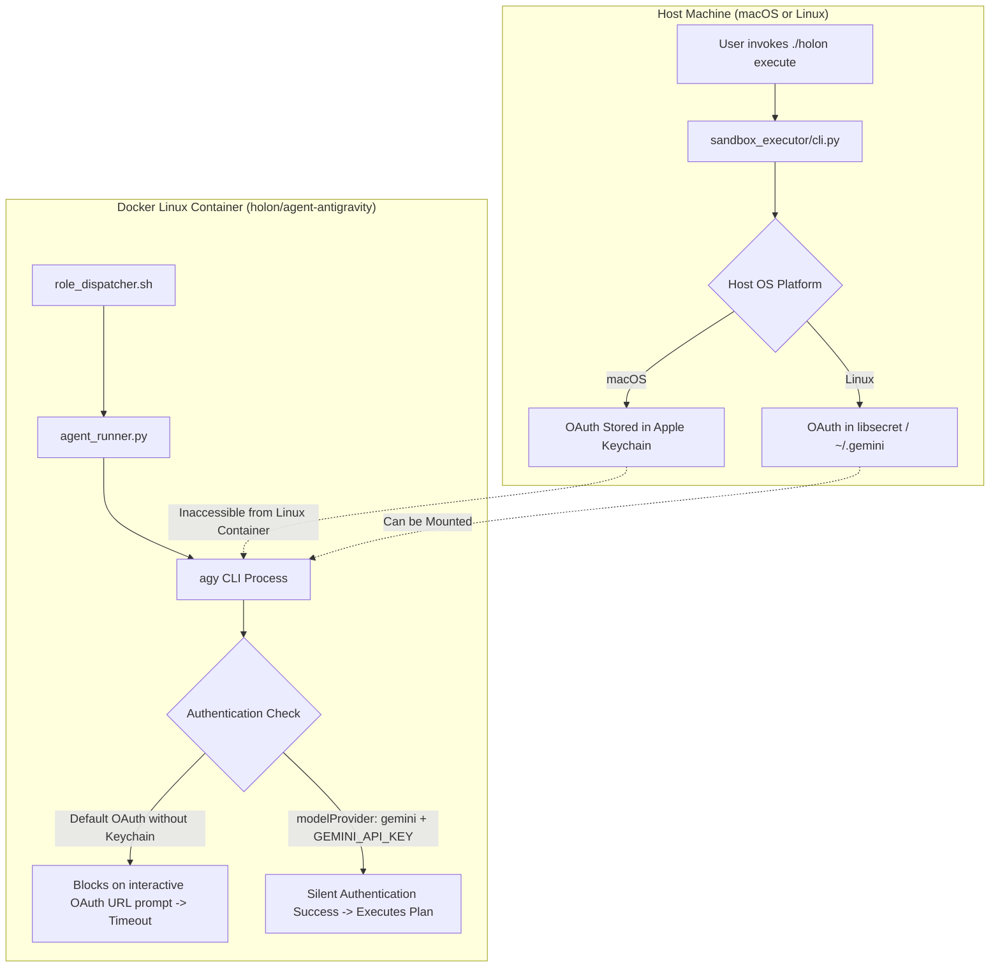

# Executing Antigravity CLI (`agy`) within Sandbox Environments (Linux & macOS Hosts)

This document analyzes the architecture, authentication behavior, technical blockers, and concrete solutions for
executing the Antigravity AI coding agent CLI (`agy`) inside containerized Docker sandbox environments
(`holon/agent-antigravity`) on both **Linux** and **macOS** hosts.

---

## 🎯 Background & Problem Statement

In the Holon Agentic Coder architecture, the **Sandbox Executor** runs coding agent CLIs (`agy`, `claude`, `pi`,
`codex`, `opencode`) inside isolated Docker containers to implement plans, run tests, and commit changes.

When running non-Google agents (`claude`, `codex`, etc.), authentication is straightforward: stateless API keys
(`ANTHROPIC_API_KEY`, `OPENAI_API_KEY`) are passed via environment variables, enabling automated headless execution
without user prompts.

However, attempting to execute `agy` inside the sandbox container out of the box fails due to authentication
requirements and platform-specific keyring behaviors.

---

## 🔍 Verification of Authentication Claims

### Claim Under Test:

> _"agy does not support service account or api key."_

### Empirical Findings:

| Authentication Method                       |       Supported by `agy`?       | Technical Details & Behavior                                                                                                                                                                                                                                                                                 |
| :------------------------------------------ | :-----------------------------: | :----------------------------------------------------------------------------------------------------------------------------------------------------------------------------------------------------------------------------------------------------------------------------------------------------------- |
| **API Key (`GEMINI_API_KEY`)**              |     **YES (Conditionally)**     | **Supported when `modelProvider` is set to `"gemini"` in settings.**<br>When `~/.gemini/antigravity-cli/settings.json` contains `{"modelProvider": "gemini"}` and `GEMINI_API_KEY` is exported, `agy`'s internal `auth.go` uses `gemini_api_key` for silent authentication, bypassing OAuth browser prompts. |
| **API Key (Default Provider)**              |             **NO**              | If `modelProvider` is omitted or left as default, `agy` ignores `GEMINI_API_KEY` / `GOOGLE_API_KEY` and defaults to interactive Google OAuth login.                                                                                                                                                          |
| **Service Account JSON Keyfile**            | **NO (Direct) / YES (via ADC)** | `agy` does not accept raw `--service-account-key` flags. However, Google Application Default Credentials (ADC) / Workload Identity are supported via `GOOGLE_APPLICATION_CREDENTIALS`.                                                                                                                       |
| **`AGY_USER_TOKEN` (Hypothetical Env Var)** |             **NO**              | **Completely unsupported.** `agy` never reads `AGY_USER_TOKEN`. Environment variables with this name have no effect.                                                                                                                                                                                         |
| **OAuth Session / Keyring (macOS)**         |          **Host-Only**          | On macOS, OAuth tokens are stored in the Apple Keychain (`/Library/Keychains`), which cannot be accessed from inside a Linux Docker container.                                                                                                                                                               |
| **OAuth Session / Keyring (Linux)**         |      **YES (with Mounts)**      | On Linux, session directories (`~/.gemini/antigravity-cli`) and DBus session sockets can be bind-mounted into the container.                                                                                                                                                                                 |

---

## 🏗️ Architecture & Technical Blockers



### Key Failure Modes:

1. **Non-Interactive Stdin Blocking**: When `agy` runs in headless print mode (`-p`), any unauthenticated state causes
   it to print `Authentication required. Please visit the URL to log in:` and wait for authorization code input on
   stdin. Inside an automated container, this causes the process to hang or time out.

2. **Cross-OS Keyring Boundary (macOS Hosts)**: The executor CLI bind-mounts `~/.gemini/antigravity-cli` as read-only.
   On macOS, OAuth tokens are kept in the OS Keychain rather than plain JSON files. Mounting the directory alone does
   not provide credentials to the Linux container.

3. **Tool Permission Prompts**: In headless `-p` mode, `agy` requires `--dangerously-skip-permissions` to auto-approve
   tool and terminal execution requests within the sandbox container.

---

## 💡 Solutions for Linux and macOS Hosts

### 🌟 Solution 1: Headless Gemini API Key Mode (Universal & Recommended)

_Works identically across macOS hosts, Linux hosts, and CI/CD pipelines._

- **Concept**: Configure `agy` inside the container to use the Gemini provider with a standard API key.
- **Mechanism**:
  1. The host exports `HOLON_AGENT_KEY="<api_key>"`.
  2. `role_dispatcher.sh` creates `/home/holon/.gemini/antigravity-cli/settings.json` with
     `{"modelProvider": "gemini"}`.
  3. `role_dispatcher.sh` exports `GEMINI_API_KEY="${HOLON_AGENT_KEY}"`.
  4. `AntigravityAgentRunner` builds the command with `--dangerously-skip-permissions`.
- **Pros**:
  - Fully cross-platform (macOS, Linux, Kubernetes, CI/CD).
  - Zero dependencies on host OS keychains or GUI browsers.
  - Consistent with other agents (`claude`, `codex`).
- **Cons**:
  - Requires a Gemini API key.

---

### 🐧 Solution 2: Linux Host — Keyring & Session Directory Mount

_Applicable for Linux hosts using user OAuth logins._

- **Mechanism**:
  1. Bind-mount the host user's `~/.gemini/antigravity-cli` and `~/.config/antigravity` into `/home/holon/`.
  2. Bind-mount the DBus session socket:
     ```bash
     -v /run/user/${UID}/bus:/run/user/1000/bus \
     -e DBUS_SESSION_BUS_ADDRESS="unix:path=/run/user/1000/bus"
     ```
- **Pros**: Reuses the active developer login without provisioning API keys.
- **Cons**: Linux host specific; will not work on macOS Docker Desktop.

---

### 🍏 Solution 3: macOS Host — Ephemeral Token Extraction Bridge

_Applicable for macOS hosts wanting to reuse OAuth user credentials._

- **Mechanism**:
  1. A host-side pre-execution script reads the active OAuth token from the local environment using an Antigravity
     helper or `gcloud auth print-access-token`.
  2. The host writes an ephemeral secret bundle (`/run/secrets/holon_auth.json`).
  3. The container's `agent_runner.py` unpacks the token into `/home/holon/.gemini/antigravity-cli/token.json` or
     configures Application Default Credentials.
- **Pros**: Preserves user identity without hardcoded API keys.
- **Cons**: Requires host-level token extraction scripts.

---

## 🛠️ Required Code Changes in `holon-agentic-coder-ref`

### 1. `apps/sandbox-executor/entrypoint/role_dispatcher.sh`

Update the `antigravity` branch to configure `GEMINI_API_KEY` and seed `settings.json`:

```bash
case "${AGENT_ID}" in
    antigravity)
        export GEMINI_API_KEY="${HOLON_AGENT_KEY}"
        export GOOGLE_API_KEY="${HOLON_AGENT_KEY}"
        mkdir -p /home/holon/.gemini/antigravity-cli
        if [ ! -f /home/holon/.gemini/antigravity-cli/settings.json ]; then
            echo '{"modelProvider": "gemini"}' > /home/holon/.gemini/antigravity-cli/settings.json
        fi
        ;;
```

### 2. `apps/sandbox-executor/src/sandbox_executor/agent_runner.py`

Update `AntigravityAgentRunner` to include `--dangerously-skip-permissions`:

```python
class AntigravityAgentRunner(StandardAgentRunner):
    """Runner for the Antigravity agent."""

    def build_cmd(self, model_name: str, prompt_file: str, intent_file: str, full_prompt: str) -> list[str]:
        self.prefix = ["--dangerously-skip-permissions"]
        self.suffix = ["--effort", os.getenv("HOLON_AGENT_EFFORT", "medium"), "-p"]
        return super().build_cmd(model_name, prompt_file, intent_file, full_prompt)
```

---

## 📋 Summary Matrix

| Host Environment         | Recommended Approach                          | Key Environment / Mount Requirements                        |
| :----------------------- | :-------------------------------------------- | :---------------------------------------------------------- |
| **macOS Host**           | **Solution 1 (Gemini API Key)**               | `HOLON_AGENT_KEY=<api_key>` + `{"modelProvider": "gemini"}` |
| **Linux Host (Local)**   | **Solution 1** or **Solution 2 (DBus mount)** | `HOLON_AGENT_KEY=<api_key>` OR DBus socket mount            |
| **CI / Cloud Sandboxes** | **Solution 1 (Gemini API Key)**               | `HOLON_AGENT_KEY=<api_key>` in CI secrets                   |
