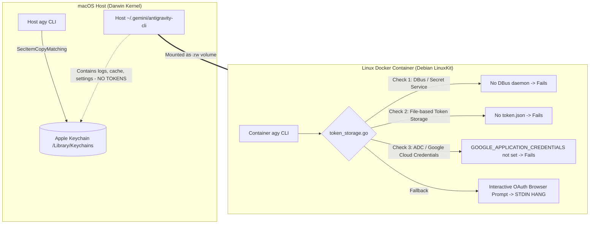

# Antigravity CLI (`agy`) Docker Sandbox Execution Experiments

This document records the empirical experiments, test scenarios, logs, and architectural findings from evaluating the
execution of the Antigravity AI coding agent CLI (`agy`) inside isolated Docker sandbox containers
(`holon/agent-antigravity`).

---

## 🎯 Objective

Determine the runtime behavior, filesystem requirements, and authentication boundaries of `agy` when executed inside
containerized Linux sandboxes on a macOS host.

---

## 💻 Test Environment

- **Host Operating System**: macOS Darwin (Apple Silicon `arm64`)
- **Docker Engine**: Docker Desktop `v29.7.2` (LinuxKit kernel `7.0.12`, `aarch64`)
- **Docker Image**: `holon/agent-antigravity:latest` (built on `python:3.13-slim` / Debian GNU/Linux)
- **Container User**: `holon` (`uid=1000`, `gid=1000`)
- **Antigravity CLI Version**: `agy v1.1.7` (installed at `/home/holon/.local/bin/agy`)

---

## 🧪 Experiment Matrix & Results

| #     | Test Scenario                                | Command Executed                                    |       Result       | Primary Failure / Success Indicator                                                                                      |
| :---- | :------------------------------------------- | :-------------------------------------------------- | :----------------: | :----------------------------------------------------------------------------------------------------------------------- |
| **1** | **Base CLI Verification**                    | `agy --version`, `agy --help`                       |      **PASS**      | Successfully returns version `1.1.7` and usage flags.                                                                    |
| **2** | **Unauthenticated Headless Prompt**          | `agy --dangerously-skip-permissions -p "say hello"` | **HANG / TIMEOUT** | Prompts for OAuth web login on `accounts.google.com` and blocks indefinitely on `stdin`.                                 |
| **3** | **Read-Only Session Mount (`:ro`)**          | `docker run -v ~/.gemini/antigravity-cli:...:ro`    |      **FAIL**      | Write errors on cache/state: `open cache/default_project_id.txt: read-only file system` + `Not logged into Antigravity`. |
| **4** | **Read-Write Session Mount (`:rw`)**         | `docker run -v ~/.gemini/antigravity-cli:...:rw`    |      **FAIL**      | Directory writes succeed, but auth fails (`Error: Please sign in to view available models`).                             |
| **5** | **Full `~/.gemini` Directory Mount (`:rw`)** | `docker run -v ~/.gemini:/home/holon/.gemini:rw`    |      **FAIL**      | Eliminates directory permission errors, but authentication still fails (`You are not logged into Antigravity`).          |
| **6** | **Settings Provider Override Injection**     | `{"modelProvider": "gemini"}` + `GEMINI_API_KEY`    |      **FAIL**      | `agy models` still requires OAuth login when running against standard Google endpoints.                                  |

---

## 🔬 Detailed Experiment Logs & Analysis

### Experiment 1: Baseline CLI Execution inside Sandbox

#### Command:

```bash
docker run --rm holon/agent-antigravity agy --version
```

#### Output:

```text
1.1.7
```

#### Finding:

The binary is properly installed, dynamically linked, and executes normally inside the container.

---

### Experiment 2: Headless Print Mode (`-p`) Authentication Blocking

#### Command:

```bash
docker run --rm holon/agent-antigravity agy --dangerously-skip-permissions -p "say hello"
```

#### Output:

```text
Authentication required. Please visit the URL to log in:
  https://accounts.google.com/o/oauth2/auth?access_type=offline&client_id=1071006060591-tmhssin2h21lcre235vtolojh4g403ep.apps.googleusercontent.com...

Waiting for authentication (timeout 60s)...
Or, paste the authorization code here and press Enter:
```

#### Finding:

When unauthenticated, `agy` does not exit immediately with an error code. Instead, it enters an interactive loop
awaiting an OAuth callback or authorization code on `stdin`. In non-interactive CI/CD or sandbox runners, this stalls
until timeout.

---

### Experiment 3: Read-Only Bind Mount (`:ro`)

#### Command:

```bash
docker run --rm \
  -v /Users/thomashan/.gemini/antigravity-cli:/home/holon/.gemini/antigravity-cli:ro \
  holon/agent-antigravity agy models
```

#### Output:

```text
E0821 12:24:02.318150 1 server.go:1771] failed to start projects watcher: failed to create projects dir /home/holon/.gemini/config/projects: mkdir /home/holon/.gemini/config: permission denied
E0821 12:24:02.369337 1 server.go:2088] failed to populate builtins: failed to clean up stale builtin directory: unlinkat /home/holon/.gemini/antigravity-cli/builtin: read-only file system
E0821 12:24:02.378288 1 common.go:325] failed to resolve project: project: failed to write default project ID: open /home/holon/.gemini/antigravity-cli/cache/default_project_id.txt: read-only file system
Error: Please sign in to view available models. Launch the CLI without arguments to sign in.
```

#### Finding:

`agy` requires active write access to its application directory for project resolution, builtin discovery, and
trajectory caching. Read-only mounts directly break internal server initialization.

---

### Experiment 4: Read-Write Bind Mount (`:rw`)

#### Command:

```bash
docker run --rm \
  -v /Users/thomashan/.gemini/antigravity-cli:/home/holon/.gemini/antigravity-cli:rw \
  holon/agent-antigravity \
  bash -c '
    touch /home/holon/.gemini/antigravity-cli/test_write_marker && rm /home/holon/.gemini/antigravity-cli/test_write_marker
    agy --log-file /tmp/agy.log models || true
    cat /tmp/agy.log
  '
```

#### Output:

```text
I0821 12:26:47.156292 7 token_storage.go:111] Using file-based token storage because no D-Bus session bus detected
E0821 12:26:47.111857 7 log.go:398] Failed to poll ListExperiments: error getting token source: You are not logged into Antigravity.
W0821 12:26:47.112291 7 log_context.go:117] Cache(loadCodeAssistResponse): Singleflight refresh failed: error getting token source: You are not logged into Antigravity.
Error: Please sign in to view available models. Launch the CLI without arguments to sign in.
```

#### Finding:

1. Write access succeeds without `read-only file system` errors.
2. However, authentication still fails completely.
3. `token_storage.go` detects no D-Bus session bus and falls back to looking for local file-based credentials, which do
   not exist in `~/.gemini/antigravity-cli`.

---

## 🔍 Root Cause Analysis: The macOS Host / Linux Container Boundary

Binary inspection of `/home/holon/.local/bin/agy` revealed the credential storage mechanism:



## 🔗 Related Architecture & Solutions

For the comprehensive analysis of evaluated solutions, token bridge implementations, and recommended sandbox session
architecture, see:

- [Executing Antigravity CLI within Sandbox Environments](./agy_sandbox_execution_solutions.md)
