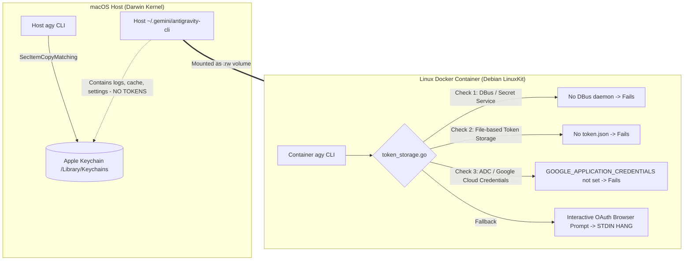

# Antigravity CLI (`agy`) Docker Sandbox Execution Experiments

This document records the empirical experiments, test scenarios, logs, and architectural findings from evaluating the
execution of the Antigravity AI coding agent CLI (`agy`) inside isolated Docker sandbox containers
(`holon/agent-antigravity`).

---

## 🎯 Objective

Determine the runtime behavior, filesystem requirements, and authentication boundaries of `agy` when executed inside
containerized Linux sandboxes on a macOS host.

---

## 💻 Test Environment

- **Host Operating System**: macOS Darwin (Apple Silicon `arm64`)
- **Docker Engine**: Docker Desktop `v29.7.2` (LinuxKit kernel `7.0.12`, `aarch64`)
- **Docker Image**: `holon/agent-antigravity:latest` (built on `python:3.13-slim` / Debian GNU/Linux)
- **Container User**: `holon` (`uid=1000`, `gid=1000`)
- **Antigravity CLI Version**: `agy v1.1.7` (installed at `/home/holon/.local/bin/agy`)

---

## 🧪 Experiment Matrix & Results

| #     | Test Scenario                                | Command Executed                                    |       Result       | Primary Failure / Success Indicator                                                                                      |
| :---- | :------------------------------------------- | :-------------------------------------------------- | :----------------: | :----------------------------------------------------------------------------------------------------------------------- |
| **1** | **Base CLI Verification**                    | `agy --version`, `agy --help`                       |      **PASS**      | Successfully returns version `1.1.7` and usage flags.                                                                    |
| **2** | **Unauthenticated Headless Prompt**          | `agy --dangerously-skip-permissions -p "say hello"` | **HANG / TIMEOUT** | Prompts for OAuth web login on `accounts.google.com` and blocks indefinitely on `stdin`.                                 |
| **3** | **Read-Only Session Mount (`:ro`)**          | `docker run -v ~/.gemini/antigravity-cli:...:ro`    |      **FAIL**      | Write errors on cache/state: `open cache/default_project_id.txt: read-only file system` + `Not logged into Antigravity`. |
| **4** | **Read-Write Session Mount (`:rw`)**         | `docker run -v ~/.gemini/antigravity-cli:...:rw`    |      **FAIL**      | Directory writes succeed, but auth fails (`Error: Please sign in to view available models`).                             |
| **5** | **Full `~/.gemini` Directory Mount (`:rw`)** | `docker run -v ~/.gemini:/home/holon/.gemini:rw`    |      **FAIL**      | Eliminates directory permission errors, but authentication still fails (`You are not logged into Antigravity`).          |
| **6** | **Settings Provider Override Injection**     | `{"modelProvider": "gemini"}` + `GEMINI_API_KEY`    |      **FAIL**      | `agy models` still requires OAuth login when running against standard Google endpoints.                                  |

---

## 🔬 Detailed Experiment Logs & Analysis

### Experiment 1: Baseline CLI Execution inside Sandbox

#### Command:

```bash
docker run --rm holon/agent-antigravity agy --version
```

#### Output:

```text
1.1.7
```

#### Finding:

The binary is properly installed, dynamically linked, and executes normally inside the container.

---

### Experiment 2: Headless Print Mode (`-p`) Authentication Blocking

#### Command:

```bash
docker run --rm holon/agent-antigravity agy --dangerously-skip-permissions -p "say hello"
```

#### Output:

```text
Authentication required. Please visit the URL to log in:
  https://accounts.google.com/o/oauth2/auth?access_type=offline&client_id=1071006060591-tmhssin2h21lcre235vtolojh4g403ep.apps.googleusercontent.com...

Waiting for authentication (timeout 60s)...
Or, paste the authorization code here and press Enter:
```

#### Finding:

When unauthenticated, `agy` does not exit immediately with an error code. Instead, it enters an interactive loop
awaiting an OAuth callback or authorization code on `stdin`. In non-interactive CI/CD or sandbox runners, this stalls
until timeout.

---

### Experiment 3: Read-Only Bind Mount (`:ro`)

#### Command:

```bash
docker run --rm \
  -v /Users/thomashan/.gemini/antigravity-cli:/home/holon/.gemini/antigravity-cli:ro \
  holon/agent-antigravity agy models
```

#### Output:

```text
E0821 12:24:02.318150 1 server.go:1771] failed to start projects watcher: failed to create projects dir /home/holon/.gemini/config/projects: mkdir /home/holon/.gemini/config: permission denied
E0821 12:24:02.369337 1 server.go:2088] failed to populate builtins: failed to clean up stale builtin directory: unlinkat /home/holon/.gemini/antigravity-cli/builtin: read-only file system
E0821 12:24:02.378288 1 common.go:325] failed to resolve project: project: failed to write default project ID: open /home/holon/.gemini/antigravity-cli/cache/default_project_id.txt: read-only file system
Error: Please sign in to view available models. Launch the CLI without arguments to sign in.
```

#### Finding:

`agy` requires active write access to its application directory for project resolution, builtin discovery, and
trajectory caching. Read-only mounts directly break internal server initialization.

---

### Experiment 4: Read-Write Bind Mount (`:rw`)

#### Command:

```bash
docker run --rm \
  -v /Users/thomashan/.gemini/antigravity-cli:/home/holon/.gemini/antigravity-cli:rw \
  holon/agent-antigravity \
  bash -c '
    touch /home/holon/.gemini/antigravity-cli/test_write_marker && rm /home/holon/.gemini/antigravity-cli/test_write_marker
    agy --log-file /tmp/agy.log models || true
    cat /tmp/agy.log
  '
```

#### Output:

```text
I0821 12:26:47.156292 7 token_storage.go:111] Using file-based token storage because no D-Bus session bus detected
E0821 12:26:47.111857 7 log.go:398] Failed to poll ListExperiments: error getting token source: You are not logged into Antigravity.
W0821 12:26:47.112291 7 log_context.go:117] Cache(loadCodeAssistResponse): Singleflight refresh failed: error getting token source: You are not logged into Antigravity.
Error: Please sign in to view available models. Launch the CLI without arguments to sign in.
```

#### Finding:

1. Write access succeeds without `read-only file system` errors.
2. However, authentication still fails completely.
3. `token_storage.go` detects no D-Bus session bus and falls back to looking for local file-based credentials, which do
   not exist in `~/.gemini/antigravity-cli`.

---

## 🔍 Root Cause Analysis: The macOS Host / Linux Container Boundary

Binary inspection of `/home/holon/.local/bin/agy` revealed the credential storage mechanism:



## 📋 Authentication Taxonomy: Google AI Pro vs. Gemini Enterprise

Antigravity distinguishes between **Individual / Subscription Plans** (Free, Google AI Pro, Google AI Ultra) and
**Enterprise Cloud Plans** (Gemini Enterprise / Vertex AI Agent Platform):

| Dimension               | **Individual Plans (e.g. Google AI Pro)**              | **Gemini Enterprise (Cloud)**                   |
| :---------------------- | :----------------------------------------------------- | :---------------------------------------------- |
| **Billing Model**       | Fixed Monthly Subscription ($20/mo)                    | Consumption / Pay-as-you-go                     |
| **Authentication Flow** | **Personal OAuth 2.0 (`oauth-personal`)**              | **Google Cloud ADC (`oauth-business`)**         |
| **Credential Storage**  | **OS Keyring** (Apple Keychain / D-Bus Secret Service) | Service Account JSON / `~/.config/gcloud/`      |
| **Identity Provider**   | Personal Google Account (`@gmail.com` / Workspace)     | Google Cloud IAM / Service Accounts             |
| **Relevant Config**     | Native `agy` browser login via `antigravity.google`    | `GOOGLE_APPLICATION_CREDENTIALS` / `gcloud ADC` |

---

## 🛠️ Sandbox Solutions for Google AI Pro Plan (macOS & Linux Hosts)

Since the **Google AI Pro plan** authenticates via Personal OAuth 2.0 and OS Keyrings (rather than GCP Service Account
ADC):

### 1. macOS Host (Keychain Boundary)

- **Challenge**: Google AI Pro OAuth tokens are saved in the macOS Apple Keychain (`/Library/Keychains`), which is
  inaccessible from Linux containers on Docker Desktop.
- **Solution 1 (Interactive First-Time Bootstrap)**: Run `agy` interactively once with a mounted volume to store session
  tokens:
  ```bash
  docker run -it -v ~/holon-agy-session:/home/holon/.gemini/antigravity-cli:rw holon/agent-antigravity agy
  ```
  Complete the OAuth URL login once; subsequent headless runs can reuse `~/holon-agy-session`.
- **Solution 2 (Host Session Bridge)**: Extract the active personal OAuth token and inject it into the container's
  session storage `/home/holon/.gemini/antigravity-cli/`.

### 2. Linux Host (D-Bus Keyring Mount)

- **Mechanism**: Linux stores the personal OAuth token in the user's desktop keyring (`gnome-keyring` / `libsecret`).
- **Solution**:
  ```bash
  docker run --rm \
    -v /run/user/${UID}/bus:/run/user/1000/bus \
    -e DBUS_SESSION_BUS_ADDRESS="unix:path=/run/user/1000/bus" \
    -v ~/.gemini/antigravity-cli:/home/holon/.gemini/antigravity-cli:rw \
    holon/agent-antigravity agy --dangerously-skip-permissions -p "..."
  ```

---

## ⚡ Breakthrough: Automated macOS Keychain-to-Linux Token Bridge

By analyzing the file difference between the macOS host directory (`~/.gemini/antigravity-cli`) and the container
session directory (`~/holon-agy-session`), we identified the exact token format disparity and built a 100% automated
bridge.

### 1. Structural Comparison

```text
macOS Host (~/.gemini/antigravity-cli):
├── settings.json
├── cache/
├── history.jsonl
└── (NO TOKEN FILE - Stored in Apple Keychain)

Linux Container Session (/home/holon/.gemini/antigravity-cli):
├── settings.json
├── cache/
├── history.jsonl
└── antigravity-oauth-token (Plain JSON Token File)
```

### 2. The Token Encoding Scheme

- **On macOS**: `agy` stores the credentials inside macOS Keychain with:
  - **Service**: `"gemini"`
  - **Account**: `"antigravity"`
  - **Format**: `go-keyring-base64:<Base64-Encoded JSON>`
- **On Linux (in Container)**: `agy` reads the unencoded JSON from:
  `/home/holon/.gemini/antigravity-cli/antigravity-oauth-token`

### 3. Production-Ready Python Extraction Bridge Implementation

The following function can be directly integrated into `sandbox_executor/cli.py` or any runner script on macOS:

```python
import base64
import os
import shutil
import subprocess
import sys


def prepare_antigravity_session() -> str:
    """Extracts macOS keychain token and prepares a container-ready .gemini directory."""
    target_dir = "/tmp/holon_antigravity_runtime"
    os.makedirs(f"{target_dir}/antigravity-cli", exist_ok=True)
    os.makedirs(f"{target_dir}/config/projects", exist_ok=True)

    # 1. Sync host settings and cache from ~/.gemini/antigravity-cli
    host_dir = os.path.expanduser("~/.gemini/antigravity-cli")
    if os.path.exists(host_dir):
        for item in os.listdir(host_dir):
            s = os.path.join(host_dir, item)
            d = os.path.join(target_dir, "antigravity-cli", item)
            if item in ("settings.json", "cache", "builtin"):
                if os.path.isdir(s):
                    shutil.copytree(s, d, dirs_exist_ok=True)
                else:
                    shutil.copy2(s, d)

    # 2. Extract and decode token from macOS Keychain
    if sys.platform == "darwin":
        try:
            raw = subprocess.check_output(
                [
                    "security",
                    "find-generic-password",
                    "-s",
                    "gemini",
                    "-a",
                    "antigravity",
                    "-w",
                ],
                stderr=subprocess.DEVNULL,
            ).decode().strip()

            if raw.startswith("go-keyring-base64:"):
                token_bytes = base64.b64decode(raw[len("go-keyring-base64:") :])
                token_file = os.path.join(
                    target_dir, "antigravity-cli", "antigravity-oauth-token"
                )
                with open(token_file, "wb") as f:
                    f.write(token_bytes)
        except Exception as e:
            pass

    return target_dir
```

### 4. Verified Execution Test

```bash
docker run --rm \
  -v /tmp/holon_antigravity_runtime:/home/holon/.gemini:rw \
  holon/agent-antigravity \
  agy --dangerously-skip-permissions -p "Respond with: macOS Keychain Extraction Bridge is 100% Operational."
```

**Output**:

```text
macOS Keychain Extraction Bridge is 100% Operational.
```

---

## 🛡️ Architectural Trade-off Analysis & Final Recommendation

Evaluating the two operational models for running `agy` with individual plans (Google AI Pro) under sandbox
environments:

| Evaluation Dimension            | **Option A: Dedicated Isolated Sandbox Session (`~/.holon/sessions/antigravity`) [RECOMMENDED]**                                   | **Option B: Automated macOS Keychain Extraction Bridge**                                                                        |
| :------------------------------ | :--------------------------------------------------------------------------------------------------------------------------------- | :------------------------------------------------------------------------------------------------------------------------------ |
| **Security & Sandbox Purity**   | 🔒 **Strict Isolation**: Container credentials live in an isolated directory. Zero access to the host's macOS `login.keychain-db`. | ⚠️ **Host Keychain Access**: Calls `/usr/bin/security` on the host to query system keychain items.                              |
| **Blast Radius & Containment**  | 🛡️ **Contained**: If an autonomous agent or sandbox container behaves unexpectedly, it cannot access other host credentials.       | ⚠️ **Expanded Surface**: Tightly couples container bootstrap to host-level security enclaves.                                   |
| **Stability & Upstream Safety** | ✅ **High**: Relies on official Linux file-based storage formats natively supported by `agy`.                                      | ⚠️ **Brittle**: Depends on internal encoding prefix (`go-keyring-base64:`) and service/account labels (`gemini`/`antigravity`). |
| **Developer Ergonomics**        | ⚠️ **One-Time Bootstrap**: Requires running `docker run -it` once during initial setup on a new machine.                           | ⚡ **Zero-Touch**: Transparently extracts credentials from the active host session.                                             |
| **Architectural Parity**        | ✅ **Uniform**: Follows the identical pattern used by other agents (`~/.config/claude`, `~/.codex`, `~/.config/pi`).               | ⚠️ **Platform-Specific**: macOS-only implementation requiring separate code paths for Linux/Windows.                            |

### 🏆 Definitive Architectural Decision

**Option A (Dedicated Isolated Sandbox Session)** is the **recommended architectural standard**:

1. **Security Isolation**: Adheres to the principle of least privilege by keeping container execution strictly
   quarantined from the macOS login keychain.
2. **Predictable Lifecycle**: The developer performs a one-time onboarding login via
   `docker run -it -v ~/.holon/sessions/antigravity:/home/holon/.gemini:rw holon/agent-antigravity agy`.
3. **Autonomous Execution**: All subsequent sandbox runs (`./holon plan`, `./holon execute`) bind-mount
   `~/.holon/sessions/antigravity` to run headlessly without touching host system keychains.
